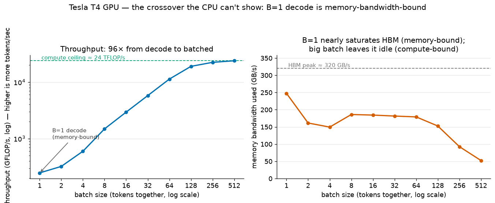

# inference-from-the-metal-up

**Why does an LLM generate tokens as slowly as it does?** Not the hand-waving answer — the measured
one. This repo works up from the hardware: one small, reproducible microbenchmark per
computer-architecture topic, each ending in a concrete, mechanical explanation of a real inference
behaviour.

Every result here was produced by running something. No topic is included unless a measurement in
this repo — not a citation — carries the argument.



*The thesis in one plot (T3): on a GPU, single-token decode sits at ~77% of HBM bandwidth and is
unambiguously memory-bound — so its speed ceiling is bandwidth ÷ weight-bytes, and no amount of extra
compute moves it. Batching is what escapes the wall.*

## Shipped topics

| # | Topic | Headline finding | Inference payoff |
|---|-------|------------------|------------------|
| [T1](topics/t01_number_representation) | Number representation & quantization | Granularity is worth ~2–3 bits. Per-tensor int4 loses **71%** of the layer output (cos 0.79); per-group holds **11%** (cos 0.99). | Why production int4 needs per-group scales — and why GPTQ/AWQ exist. One outlier sets the scale for all 885k weights. |
| [T2](topics/t02_cpu_pipeline) | CPU execution & the pipeline | Fitting the pipeline is worth **1.8×–3.2×** on identical arithmetic: branch 1.76×, ILP 3.20×, SIMD 2.35×. | Decode lands on the wrong side of all three. The serial token dependency is why batching exists. |
| [T3](topics/t03_memory_hierarchy) | Memory hierarchy & the memory wall | Traversal order is worth **~20×** — and the memory-bound crossover is set by the device's **ridge point**, not by the kernel. | Decode is memory-bound *specifically on GPUs* (T4 ridge ≈ 200 vs CPU ≈ 0.18; T7 measures 150 on an A100). Batching raises arithmetic intensity; that is continuous batching's whole lever. |
| [T4](topics/t04_concurrency) | Concurrency & synchronization | Coordination taxes, all on identical work: memory layout alone **17×**, an unsynchronised counter is **78% wrong**, a locked queue costs **456×** vs sharding. | A single-lock scheduler caps tokens/sec no matter how much GPU you attach. Real engines shard dispatch — this is why. |
| [T5](topics/t05_parallelism) | Parallelism: five ways to split a transformer | Scaling order is **not** communication order. On 4× A100 NVLink: DP **3.77×** (0 MB/step), TP **2.96×** (940 MB), PP **2.48×** (59 MB). PP is capped by its bubble at 2.91× before a byte moves; TP's bandwidth is only ~4% of its step. Routing skew alone costs EP **55%**. | Communication *volume* doesn't predict communication *cost*, let alone scaling. And DP/SP scale best while replicating the whole model — so neither can serve one that doesn't fit. |
| [T6](topics/t06_perf_reasoning) | Performance reasoning | A 7B decodes at **90.5 tok/s** on an A100 and **74% of every step is reading weights**; the KV cache is 0.2%. Effective decode bandwidth is **1,283 GB/s = 74%** of a streaming copy. CUDA graphs are worth **15–36%** of the step, and the loss *grows* with batch. One band failed on re-run (residual 26.1% against ≤25%) and is reported as failed. | `0.74 × bandwidth / bytes_per_token` predicts decode within 36%. Batch to ~32–64, not to memory: batch 256 buys 55% more throughput for 170% more tail latency. |
| [T7](topics/t07_roofline) | Roofline model & arithmetic intensity | Decode runs at **0.5%** of an A100's compute — and that is near-optimal, not wasteful: it hits **82%** of the *memory* roof it is actually under. Batching walks it from 1 to 236 FLOPs/byte, **×103 throughput to batch 128**, then **×1.04** to 256 once it crosses the ridge at 150. | Decode is memory-bound by two orders of magnitude, so quantisation (which raises intensity) beats buying FLOP/s. Batch until the ridge; the ceiling is knowable before you run anything. |
| [T8](topics/t08_gpu_architecture) | GPU architecture: what quantisation costs | A fused int4 GEMV in Triton cuts the bytes **3.88×** and buys **1.54×** against the same kernel in bf16 — which itself reaches **95.5%** of the memory roof, ahead of cuBLAS's 83.2%. Two of three pre-registered bands failed. An int8 control run through the same harness **passes** the band it fails (75.7% of its byte ratio vs 39.8%). | Quantisation does not remove work, it **trades memory traffic for arithmetic**: 4× fewer bytes costs ~4× more work per byte, against an A100's ~11.2 fp32 FLOPs per byte of measured bandwidth. Normalised to weights rather than bytes, int4 and int8 sit within 3.6% of each other (1,281 vs 1,237 Gweights/s) while their bandwidths differ by 1.9× — below bf16 the limit stops being bytes and becomes work per weight. This is the term Marlin and AWQ are built to attack. |
| [T9](topics/t09_interconnects) | Interconnects & multi-device | A decode all-reduce is **99.9% fixed cost**: 34.5 µs to move 7 KB, achieving **0.14%** of the bandwidth the same NVLink delivers to a large message. The fixed cost **did not scale with world size** (33.95 / 32.73 / 34.49 µs at 2 / 3 / 4 GPUs, against a predicted 3×) — hop count explains **9%** of its variation (R² = 0.089), and the spread across repeats **exceeds** the spread across world sizes. Amortising every host launch leaves it at 32–35 µs, so it is **device-side, not dispatch**. Three of seven pre-registered bands failed. | 56 collectives per token cost **1.93 ms = 17.5%** of T6's step — but vLLM measured end to end reaches **1.54× at TP2 and 2.23× at TP4** on a batch-1 decode, beating the model by 19–28% because it ships a custom all-reduce and CUDA-graphs the step, routing around exactly this cost. `α + n/β` bounds a naive implementation, not a real engine. Shard for capacity, not for low-batch latency; batching is what pays for the collectives (16.8 µs/token at batch 128). |

## Roadmap

Eleven topics, built in order. Nine shipped; T10 and T11 are scoped and planned.

| | Topic | Language | Status |
|---|---|---|---|
| T1 | Number representation / quantization | Python | ✅ shipped |
| T2 | CPU execution & the pipeline | C | ✅ shipped |
| T3 | Memory hierarchy | C + PyTorch | ✅ shipped |
| T4 | Concurrency & synchronization | Rust | ✅ shipped |
| T5 | Parallelism: five ways to split a transformer | Python · 4× GPU | ✅ shipped |
| T6 | Performance reasoning | Python · GPU | ✅ shipped |
| T7 | Roofline model & arithmetic intensity | Python · GPU | ✅ shipped |
| T8 | GPU architecture: fused int4 GEMV | Triton · GPU | ✅ shipped |
| T9 | Interconnects & multi-device | Python · 4× GPU | ✅ shipped |
| T10 | OS & virtual memory | C + Python | planned |
| T11 | Compiler / runtime layer | Python · GPU | planned |

## How these are measured

The numbers are only worth reading if the method is honest, so:

- **Author on the Mac; measure on real hardware.** Canonical CPU numbers come from an **AMD
  EPYC-Milan** box (Hetzner CCX33, Ubuntu 24.04, 64-byte cache line); GPU results from a T4 (T3),
  **4× A100 SXM on NV12 NVLink** (T5 and T9), and a single **A100-SXM4-80GB** for T6, T7 and T8, which
  share one measurement session so their numbers compose. T9 ran on a 4× A100 node measuring
  1,736.9 GB/s against those three's 1,737, so it composes with them too. `rdtsc`, cache sizes,
  cache-line width and branch-prediction behaviour all differ on Apple Silicon, which would make the
  numbers non-canonical. Every lab note states the hardware it ran on.
- **Use the language that tells the truth.** C and Rust where cycle-level effects matter (T2–T4) —
  Python overhead would swamp a 0.36 ns/op result. Python everywhere else. Every benchmark emits CSV
  that a Python `plot.py` consumes, so the analysis layer stays uniform across languages.
- **Defeat the optimiser, then prove it.** Benchmarks carry checksums and sinks so the compiler
  cannot delete the work being timed, and fail loudly on checksum mismatch rather than reporting a
  fast lie.
- **Every lab note states what surprised me and what the result does *not* show.** The caveats are
  load-bearing: baseline-not-SOTA, single-tensor, microbenchmark-not-server. Several findings here
  contradicted what I expected going in, and are written up that way.
- **CI on every push:** ruff, pyright, pytest, plus `cargo fmt`, `clippy -D warnings`, `cargo test`.

## Layout

Each topic is self-contained in `topics/tNN_.../`: a `README.md` lab note (question → setup → result
→ headline finding → inference payoff → surprises → caveats), the benchmark source, a `plot.py`, and
a committed `results/` folder with the CSV and figures.

```bash
uv sync        # environment (Python 3.12, pinned)
make ci        # everything CI runs: lint, format, types, tests
```

Per-topic reproduce steps are in each lab note.

## License

MIT — see [`LICENSE`](LICENSE).
