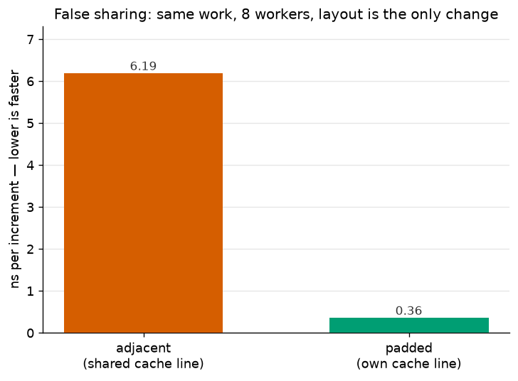
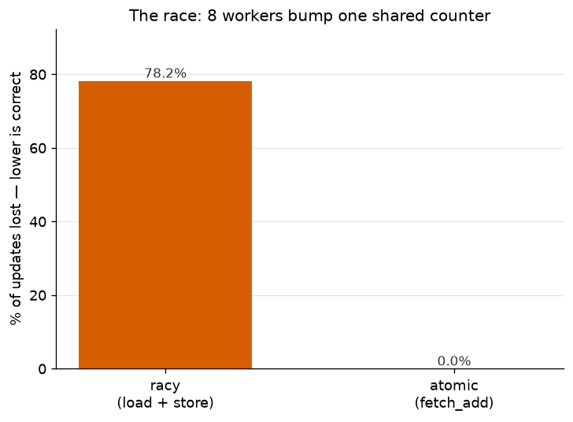
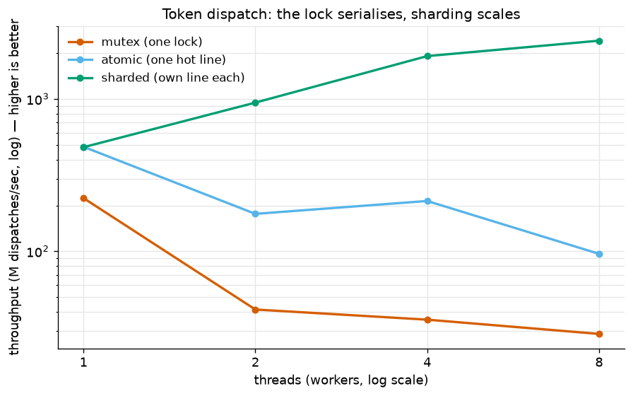
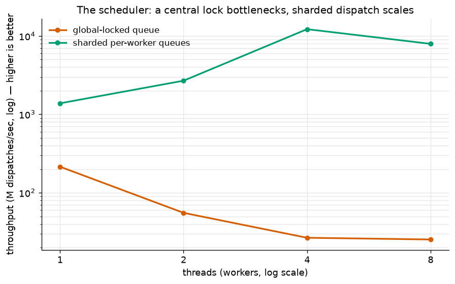

# T4 — Concurrency & synchronization

**Artefact (a04):** a from-scratch **Rust** microbenchmark measuring **what caps the throughput of a
concurrent inference server** — the coordination taxes on the shared state a token-serving loop lives
on. Four experiments, each cast as a real serving component:
1. **False sharing** (per-worker token counters) — N request-workers each tally their *own* token
   count, laid out packed into one 64-byte cache line vs padded onto separate lines. Same work, same
   result — but the shared line ping-pongs between cores and cripples throughput. The invisible tax.
2. **The race** (the throughput metric) — N workers bump one shared "tokens served" counter. An
   unsynchronised read-modify-write **loses updates** and undercounts; an atomic one is exact. Why a
   serving metric needs synchronisation (and, in Rust, why a true data race is a compile error).
3. **Contention** (token dispatch) — workers claim the next token to serve from one shared index,
   three ways: a **Mutex**, an **atomic**, and **sharded** per-worker ranges — throughput vs thread
   count. The lock serialises everyone (Amdahl's serial fraction, made visible); sharding scales.
4. **The scheduler** (request queue) — a batch of requests drained by the workers via one
   **global-locked queue** vs **sharded per-worker queues** — dispatch throughput vs threads. This is
   the continuous-batching scheduler in miniature: a central lock is why naive schedulers stop
   scaling; real engines shard the dispatch.

**Language:** Rust (std only — `std::thread`, `std::sync::atomic`, `std::sync::Mutex`). Rust's
ownership rules make data races a *compile-time* error, so this is the ideal place to show it.

**Status:** complete.

## Reproduce

```bash
cd topics/t04_concurrency
make run                # cargo build --release + run → results/concurrency.csv (+ stderr summary)
make check              # cargo fmt --check + clippy -D warnings
make test               # cargo test (correctness invariants)
uv run python plot.py   # writes results/*.png   (once plot.py covers all four)
uv run pytest .         # directional integration checks
```

**Canonical numbers require a MULTICORE Linux x86 box (8+ cores).** False sharing and lock contention
are *parallelism* effects — on 1–2 cores they barely appear. The 64-byte cache-line padding is
x86-specific (Apple Silicon uses 128-byte lines). Author on the Mac; measure on x86. **No GPU:** the
serving scheduler is host-side CPU code even when the model runs on a GPU, so this is a CPU study.

---

## Lab note

**Question.** A serving engine runs many requests concurrently over shared state — a request
scheduler and per-worker metrics. What does *coordinating* those threads cost — the cache-line tax of
false sharing, the throughput collapse from lock contention — and how do you get real speedup as
workers scale?

**Setup.** Four experiments in Rust (std only, `--release`, wall-clock via `Instant`), each explained
in plain terms first, then precisely. Each maps to a real part of a token-serving loop.

- **(a) False sharing — per-worker token counters.**
  *In plain terms:* each request-worker tallies the tokens it has generated into its own little
  counter — no counter is shared. But if those counters sit next to each other in memory, the CPU
  (which moves memory in 64-byte chunks) treats the whole chunk as contested and shuttles it between
  cores on every write. Give each its own chunk and the tax vanishes.
  *Precisely:* N threads each `fetch_add(1, Relaxed)` on a private `AtomicU64`, `iters` times.
  `adjacent`: packed `Vec<AtomicU64>` (8 per line). `padded`: each `#[repr(align(64))]` on its own
  line. `Relaxed` means the *only* cost difference is cache-line coherence — false sharing, isolated.
  Metric: **ns per increment**.

- **(b) The race — the shared throughput metric.**
  *In plain terms:* now all workers add into *one* shared "tokens served" total. Incrementing (read,
  add one, write back) isn't one indivisible step, so two workers can read the same value and both
  write back the same +1 — a count vanishes. The unsynchronised total comes out **wrong** (and more
  wrong with more workers); the atomic version is exact.
  *Precisely:* `racy` does a separate `load` then `store` (a non-atomic RMW — lost updates, but no
  undefined behaviour); `atomic` does one `fetch_add`. Metric: **% of updates lost**. (A true
  `total += 1` data race is undefined behaviour that Rust rejects at compile time.)

- **(c) Contention — token dispatch.**
  *In plain terms:* workers repeatedly claim "the next token to serve" from one shared index, done
  three ways as we add workers. A single lock forces everyone to queue (throughput stops rising, even
  falls); an atomic is faster but the one hot cache line still limits it; giving each worker its own
  pre-assigned range shares nothing and scales almost linearly.
  *Precisely:* `mutex` (`Mutex<u64>`), `atomic` (`AtomicU64::fetch_add`), and `sharded` (per-thread
  counters combined once at the end), swept over thread counts 1 → cores. Metric: **throughput
  (millions of dispatches/sec)**.

- **(d) The scheduler — request queue.**
  *In plain terms:* a batch of requests has to be handed out to the workers. Option one: all workers
  pull from a single queue guarded by one lock (a naive central scheduler). Option two: split the
  requests across per-worker queues up front (sharded dispatch) so no one waits on a shared lock. Same
  total work; the sharded scheduler scales, the locked one bottlenecks on itself.
  *Precisely:* drain a fixed workload of W request-items with N workers: `global_lock`
  (`Mutex<VecDeque<usize>>`, every pop takes the lock) vs `sharded` (W partitioned into N private
  queues). Metric: **dispatch throughput (millions of items/sec)** vs thread count. This is the
  continuous-batching scheduler's core design choice, in miniature.

- **Hardware.** **AMD EPYC-Milan, x86_64** — 8 vCPU = **4 physical cores × 2 SMT threads**, 1 socket;
  L1d 32 KB/core, L2 512 KB/core, L3 32 MB shared, **64-byte cache line** (Hetzner CCX33, Ubuntu
  24.04). Authored/debugged on an Apple-Silicon Mac; canonical numbers from x86.

**Result.**

### (a) False sharing — 17× from memory layout alone



| variant | ns / increment |
|---|---|
| adjacent (shared line) | 6.19 |
| padded (own line) | **0.36** |

Eight workers, each incrementing only its *own* counter — nothing is shared. Packed into one 64-byte
line the line ping-pongs between cores on every write: **17× slower**. Padding each counter onto its
own line removes the tax entirely. Same work, same totals; layout is the only change.

**When to pad vs pack.** Padding isn't free — it spends 56 wasted bytes per counter (64 B vs 8 B) to
buy the 17×, so it's a *targeted* fix, not a default. **Pad** a small set of *hot, per-thread,
concurrently-written* state (counters, metrics, lock-free queue slots); **pack everything else** —
packing is more cache-efficient for data that *isn't* written across cores (more data per line, fewer
misses). Real systems do exactly this surgically — Rust's `crossbeam::CachePadded`, the Linux kernel's
`____cacheline_aligned`, Java's `@Contended`. Rule of thumb: **pack by default; pad the contended hot
spots.**

### (b) The race — 78% of updates lost



| variant | updates lost |
|---|---|
| racy (load + store) | **78.2 %** |
| atomic (fetch_add) | 0.0 % |

Eight workers bump one shared counter 10 M times each (80 M expected). The non-atomic read-modify-write
counts only **17.4 M** — four of every five increments vanish into the race. One `fetch_add`
(indivisible) is exact.

### (c) Contention — a lock collapses, sharding scales



| threads | mutex | atomic | sharded |
|---|---|---|---|
| 1 | 223.6 | 485.6 | 482.7 |
| 2 | 41.5 | 176.2 | 947.3 |
| 4 | 35.6 | 214.1 | 1913.5 |
| 8 | 28.7 | 96.3 | **2415.6** |

*(Mops/s.)* The **mutex collapses** the instant threads contend (224 → 29). Even the lock-free
**atomic drops** under load (486 → 96) — a single hot cache line still bounces between cores. Only
**sharded scales**, near-linearly to the 4 physical cores (2416 = **25× the atomic, 84× the mutex** at
8 threads).

### (d) The scheduler — 456× from not sharing the queue



| threads | global-locked queue | sharded |
|---|---|---|
| 1 | 215.0 | 1382.7 |
| 2 | 55.5 | 2684.6 |
| 4 | 26.7 | **12184.3** |
| 8 | 25.4 | 7922.4 |

*(Mops/s.)* A single lock on the request queue makes the **scheduler itself the bottleneck** —
throughput falls to ~25 Mops/s no matter how many workers. Partitioning the batch into per-worker
ranges (no shared queue) scales to **456× at 4 cores**.

**Headline finding.** *How you coordinate threads decides whether a concurrent server scales — and the
answer is always "share less."* Three taxes, all on identical work: memory **layout alone** costs 17×
(false sharing); **unsynchronised** shared state is 78 % wrong (the race); and the **coordination
strategy** decides scaling — a mutex or a single hot atomic *collapses* under contention, while
**sharding scales to the physical core count** (456× a global-locked queue at 4 cores). Contention is
the enemy; you beat it by giving each worker its own state.

**Inference payoff.** This is the metal under a serving engine's throughput.
- **The scheduler experiment IS the continuous-batching design choice.** A busy server dispatches
  thousands of tokens/requests per second; route that dispatch through one lock and the *scheduler*
  caps tokens/sec (our ~25 Mops/s ceiling) no matter how much GPU you bolt on. Real engines (vLLM,
  TGI) minimise scheduler contention and shard per-worker state — Experiment (d) is why.
- **False sharing and lock contention are concrete serving bugs,** not abstractions: hot per-worker
  metrics packed adjacently (a), a global lock on the request queue (c/d). The fix — pad and shard —
  is real serving-engine code.
- **Sharding only scales to *physical* cores** (see below) — a lesson for sizing serving workers to
  hardware, not to logical thread count.
- **Through-line:** T2 showed decode is a serial dependent chain (the lock here is that same serial
  fraction — Amdahl); T3 showed *why* you batch; **T4 shows *how* you coordinate the workers that keep
  the batch full** — and that the way to scale is to stop sharing.

**What surprised me.** Four things:
- **Nothing was shared, yet layout cost 17×.** In (a) each worker touches only its own counter — the
  17× is pure hardware, invisible in the source. It made the 64-byte cache line feel *physical*.
- **A race loses most of the work, not a little.** I expected "some" lost updates; **78 %** — four of
  five — made "not atomic" visceral in a way the definition never did.
- **Sharding scales to *cores*, not *threads*.** The sharded curves climb cleanly to 4 (the physical
  cores) then flatten or even *drop* at 8 — the two SMT threads on a core share its execution units.
  Concrete proof of "threads = concurrency, cores = parallelism."
- **Lock-free wasn't contention-free.** The single shared atomic *collapsed* under load (486 → 96) —
  one hot cache line still bounces between cores. Atomics avoid the lock, not the contention.

**Caveats.**
- **Physical cores vs SMT.** This box is 4 cores × 2 threads, so the scaling curves flatten/dip past 4
  threads. A box with more physical cores would show a longer clean curve; the *direction* (sharding
  scales, locks don't) is hardware-independent.
- **The scheduler measures dispatch overhead, not per-request compute.** The sharded workers do
  trivial per-item work, so (d) isolates the *coordination* cost. If heavy per-token GPU work
  dominated, the lock would be a smaller fraction — but for short requests on a busy server, dispatch
  contention is exactly the bottleneck.
- **Microbenchmarks, not a server.** These measure the concurrency primitives a serving loop is built
  from, on one box — the inference payoff is the argued through-line, not an end-to-end measurement
  (that's the serving artefacts).
- **x86-specific constant.** The 64-byte cache-line padding is x86; Apple Silicon uses 128-byte lines,
  which would change `CachePadded`.

---

### CSV contract

The Rust `bench` binary writes `results/concurrency.csv`; `plot.py` reads it. One tidy **long
format** for all four experiments:

```
experiment,variant,threads,metric,value
false_sharing,adjacent,8,ns_per_op,...
false_sharing,padded,8,ns_per_op,...
race,racy,8,lost_pct,...
race,atomic,8,lost_pct,0.0
contention,mutex,1,mops_per_s,...
contention,atomic,4,mops_per_s,...
contention,sharded,8,mops_per_s,...
scheduler,global_lock,8,mops_per_s,...
scheduler,sharded,8,mops_per_s,...
```

- `experiment` — `false_sharing`, `race`, `contention`, or `scheduler`
- `variant` — `adjacent`/`padded`; `racy`/`atomic`; `mutex`/`atomic`/`sharded`; `global_lock`/`sharded`
- `threads` — number of threads (workers) used
- `metric` — `ns_per_op`, `lost_pct`, or `mops_per_s`
- `value` — the measured number
