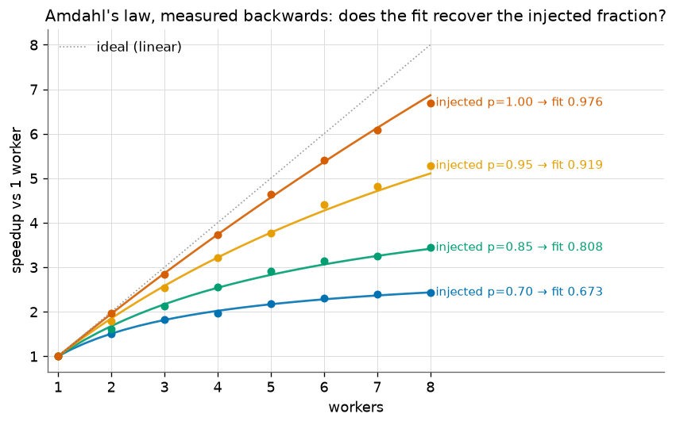
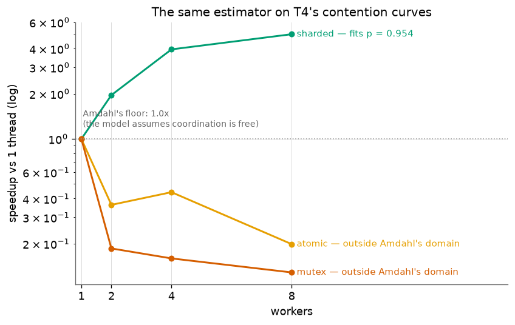
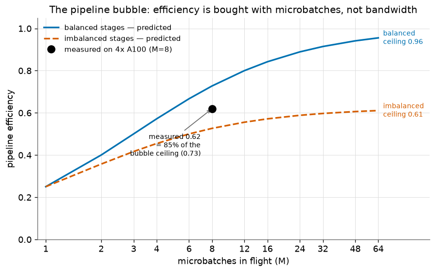
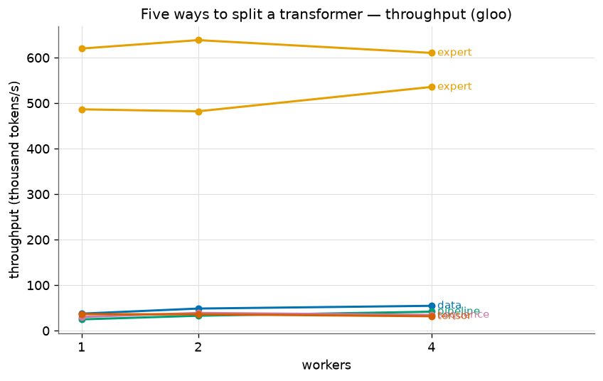
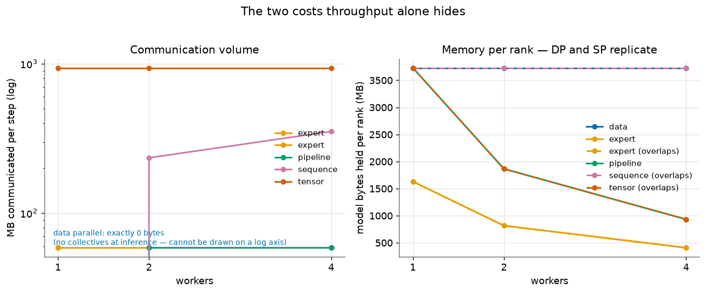
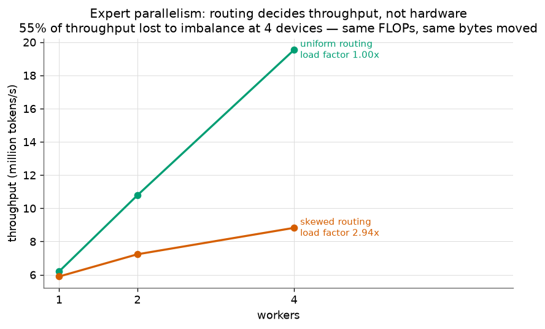

# T5 — Parallelism taxonomy: five ways to split a transformer

**What this is:** a from-scratch implementation of **all five ways a large language model is split
across devices** — data, tensor, pipeline, sequence and expert parallelism — each running on real
`torch.distributed` collectives over a real transformer block, measured on the three axes that
decide which one you pick: **throughput**, **bytes communicated**, and **model bytes held per
device**. Plus two supporting experiments: Amdahl's law used as a *measuring instrument* rather
than a plotted formula, and the pipeline bubble measured against its closed form.

**Status:** complete. Canonical numbers measured on **4x A100 SXM (NV12 NVLink)** with
Qwen2.5-7B in bfloat16, via real NCCL collectives.

## Reproduce

**Correctness and Experiment A — any machine, no GPU:**

```bash
uv sync                                                       # once, from the repo root
uv run pytest topics/t05_parallelism                          # 45 unit tests
uv run python topics/t05_parallelism/amdahl.py                # experiment A
uv run python topics/t05_parallelism/strategies.py --backend gloo --world-sizes 1,2,4
uv run python topics/t05_parallelism/plot.py                  # figures
```

**The canonical numbers in this note** — exactly the commands that produced them, on a 4x A100
SXM node:

```bash
python strategies.py --backend nccl --world-sizes 1,2,4 \
    --dtype bfloat16 --model Qwen/Qwen2.5-7B --batch 16 --seq 512 --layers 8
python strategies.py --backend nccl --world-sizes 1,2,4 --strategies ep --routing skewed \
    --dtype bfloat16 --model Qwen/Qwen2.5-7B --batch 16 --seq 512 --layers 8
```

The harness is **backend-agnostic**: `--backend gloo` runs on CPU, `--backend nccl` runs the
*identical* strategy code on GPUs. CPU is for correctness and rehearsal; GPU is for the numbers.
Use a small model on CPU (`JackFram/llama-160m`, the default) and a 7B on GPU — a 160M model on an
A100 measures kernel-launch overhead rather than communication.

---

## Lab note

**Question.** A model no longer fits, or no longer runs fast enough, on one device. There are
exactly five axes you can cut it along. What does each one actually cost — in communication, in
memory per device, and in throughput — and how does each one fail?

### Setup

*In plain terms:* take one real transformer block, split it five different ways across several
processes, and make each split talk over the same machinery real serving engines use. Then measure
not just which is fastest, but what each one is *spending* to get there — because the fastest
option on one axis is often the one that cannot help you at all on another.

- **Model.** One Llama-architecture transformer block — attention **and** SwiGLU MLP, RMSNorm,
  both residuals — with real weights. **Qwen2.5-7B** (hidden 3584, 28 heads, 4 KV heads) for the
  GPU measurements; `JackFram/llama-160m` for CPU development. A 160M model on an A100 would make
  TP look terrible for the wrong reason: its matmuls take microseconds, so the measurement would
  be kernel-launch overhead rather than communication. Attention is load-bearing here and not
  decoration: see *Why attention had to be included*.
- **The five strategies**, each on real `torch.distributed` collectives:

  | | what gets split | collectives per block | fails when |
  |---|---|---|---|
  | **DP** data | the batch | none | the model does not fit on one device |
  | **TP** tensor | every weight matrix (heads, intermediate) | 2 × all-reduce | the interconnect is slow |
  | **PP** pipeline | the layers (depth) | 1 × send/recv per seam | microbatches are few (the bubble) |
  | **SP** sequence | the sequence | 1 × all-gather | sequences are short (gather ≈ pure overhead) |
  | **EP** expert | the experts of an MoE | all-gather + all-reduce | routing is uneven |

- **Metrics.** Throughput (tokens/s); **bytes communicated per step**; **model bytes held per
  rank**. The last two are computed from the shapes, so they are *device-independent* — they stay
  true on hardware this study did not rent, which is what lets a CPU rehearsal say something
  honest about GPUs.
- **Correctness.** Every strategy is checked against the unsharded forward every run. A fast wrong
  answer is the easiest thing to produce here, and this check caught a real one (see *What
  surprised me*): data parallelism silently splitting the sequence instead of the batch, running
  at full speed and returning wrong output.
- **Hardware.** **4x A100-SXM4-80GB**, NV12 NVLink between every GPU pair (12 bonded links,
  ~600 GB/s), CUDA 12.4, torch 2.8, NCCL. Development and correctness on CPU with the gloo backend
  — the strategy code is identical on both, so the CPU run is a genuine rehearsal rather than an
  approximation.

### Result A — Amdahl's law, measured backwards

Plotting `S = 1/((1-p) + p/n)` proves nothing: it is a closed form, and the curve is whatever you
assert `p` to be. So this runs it the other way. Inject a **known** serial fraction, measure the
real speedup curve, fit Amdahl to the measurement, and ask whether the fit recovers what was put
in. The fit is exact linear least squares via `1/S - 1 = p(1/n - 1)`, not a search.

| injected p | recovered p | error | R² |
|---|---|---|---|
| 1.00 | 0.976 | −0.024 | 0.9993 |
| 0.95 | 0.919 | −0.031 | 0.9947 |
| 0.85 | 0.808 | −0.042 | 0.9904 |
| 0.70 | 0.673 | −0.027 | 0.9943 |



The estimator recovers the injected fraction to within 0.04 with R² > 0.99, and is **consistently
biased low** — which is the honest answer, not an error: real parallel overhead (thread start-up,
memory contention) is genuinely there, so the measured curve really is slightly worse than the
injected fraction alone predicts.

Now point the validated estimator at T4's contention curves, where the serial fraction was never
known:



| T4 variant | recovered p | R² |
|---|---|---|
| sharded | **0.954** | 0.9561 |
| atomic | **−3.400** | 0.3651 |
| mutex | **−7.665** | 0.8189 |

**Sharded dispatch fits Amdahl cleanly at p = 0.954.** The mutex and the atomic fit **p < 0** —
they are *outside the model's domain entirely*. Amdahl's floor is 1.0×, because the law assumes
coordination is free: the worst a program can do is refuse to parallelise. T4's contended cases are
worse than that — adding workers made them actively slower. The estimator is deliberately not
clamped to [0, 1], so this shows up as a negative number rather than being quietly rounded to
"perfectly serial."

### Result B — the pipeline bubble, predicted and tested

Pipeline parallelism's cost is not bandwidth, it is **idle time**. With P stages and M microbatches
in flight, stage *r* cannot start microbatch 0 until stages 0..r-1 have finished it, and it runs
dry at the end. Efficiency is capped at

    efficiency = M / (M + P - 1)

which generalises to uneven stages as `M·ΣW / (P·(ΣW + (M-1)·max W))`. Both forms are unit-tested
against their closed forms, including the asymptotes: a balanced pipeline approaches but never
reaches 1.0, and an imbalanced one is capped by its slowest stage at `ΣW / (P · max W)` — 0.625 for
a 4-stage line where one stage is twice as slow.



**The test.** PP in Result C ran with P = 4 stages and M = 8 microbatches, so the law predicts a
ceiling of `8/11` = **0.727** efficiency — a maximum of 2.91x on four devices, *before a single
byte is communicated*. PP measured **2.48x, i.e. 0.62 efficiency — 85% of that ceiling.** The
remaining 15% is activation hand-off and stage jitter.

So PP's last-place scaling is not a mystery and not a bandwidth problem: **a closed-form model
written before the run predicts nearly all of it.** The figure plots that prediction with the
measured point on it; the CPU microbatch sweep is deliberately *not* plotted, because on a machine
where BLAS matmul does not parallelise across threads its efficiency numbers would measure the
hardware rather than the bubble.

### Result C — what the five strategies actually cost

Measured on **4x A100-SXM4-80GB, NV12 NVLink between every pair** (~600 GB/s), Qwen2.5-7B,
bfloat16, 8 layers, 16x512 tokens per step, real NCCL collectives. Every point is checked against
the unsharded forward before its throughput is recorded.

| strategy | 1 GPU | 2 GPUs | 4 GPUs | **scaling** | MB comms/step | MB held/rank |
|---|---|---|---|---|---|---|
| **DP** data | 420,658 | 817,766 | **1,585,973** | **3.77x** | **0** | 3,729 |
| **SP** sequence | 413,901 | 763,934 | **1,324,093** | 3.20x | 352 | 3,729 |
| **EP** expert *(uniform)* | 6,197,029 | 10,782,729 | **19,533,252** | 3.15x | 59 | 407 |
| **TP** tensor | 418,602 | 745,313 | **1,237,652** | 2.96x | **940** | 932 |
| **PP** pipeline | 369,178 | 653,302 | **914,652** | **2.48x** | 59 | 932 |

*(tokens/s. EP runs an MoE layer rather than a dense block, so its absolute throughput is not
comparable to the others — only its scaling is, which is why the figure below plots speedup.)*



**Scaling order is not communication order.** Ranked by bytes moved, the order is
DP (0) < PP = EP (59 MB) < SP (352) < TP (940). Ranked by scaling it is
DP > SP > EP > TP > **PP**. The strategy that communicates least among the dense three scales
*worst*. Whatever is costing these strategies their scaling, it is not simply bandwidth.

**Where PP's loss comes from: the bubble, quantitatively.** With P = 4 stages and M = 8
microbatches, Result B's formula caps efficiency at `M/(M+P-1)` = 8/11 = **0.727**, i.e. a ceiling
of **2.91x** on four devices *before a single byte is sent*. PP measured **2.48x — 85% of that
ceiling**. Its poor scaling is almost entirely structural idle time, and the closed form predicted
it independently.

**Where TP's loss does *not* come from: bandwidth.** This is the part that surprised me and the
part I initially got wrong. TP's 940 MB payload becomes ~1.41 GB of wire traffic for a ring
all-reduce, which at NV12's ~600 GB/s is **2.35 ms against a 52.9 ms step — about 4%**. But TP
scales ~21% worse than DP. **Bandwidth accounts for roughly a fifth of TP's loss.** The rest is
not volume but *frequency and shape*: 16 blocking all-reduces per step (two per layer), each a
barrier where every rank waits for the slowest, plus each rank running a matmul 1/4 the size and
therefore proportionally less efficient on the GPU.

So the honest statement is stronger than "communication is expensive": **communication *volume*
does not even predict communication *cost*, let alone scaling.** Two strategies moving 59 MB each
(PP and EP) scale 2.48x and 3.15x. One moving 16x more (TP) beats both of them on one axis and
loses on another.

**The memory column decides which strategies are even available.** DP and SP hold **3,729 MB per
rank at every world size** — they replicate. TP and PP divide to 932 MB at four devices; EP to 407.
So the fastest-scaling strategy is the one that cannot serve a model too large for one device. The
two axes disagree, and only reading both tells you what you are allowed to choose.



**Expert parallelism: the router decides throughput, not the hardware.**

| routing | 1 GPU | 2 GPUs | 4 GPUs | scaling | load factor at 4 |
|---|---|---|---|---|---|
| uniform | 6,197,029 | 10,782,729 | 19,533,252 | **3.15x** | 1.00 |
| **skewed** | 5,894,224 | 7,231,198 | 8,822,524 | **1.50x** | **2.94** |



Skewed routing costs **55% of EP's throughput at four devices** — 8.8M against 19.5M tokens/s on
identical hardware, identical FLOPs and identical communication (59 MB either way). Four devices
deliver 1.50x. The only difference is *where the router sent the tokens*: the rank holding the
popular expert does 2.94x the average work and everyone else waits at the collective. DP, TP, PP
and SP split a fixed amount of work into equal pieces; **EP's split is decided at runtime by the
data**, so adding hardware cannot fix it. This is why MoE serving stacks spend so much effort on
auxiliary load-balancing losses and expert capacity limits.

### Result D — TP degree is not a free parameter

Tensor-parallel degree must **divide the attention head count**, and with grouped-query attention
it is additionally capped at `num_key_value_heads`. Surveying small open models:

| model | heads | KV heads | usable TP degrees |
|---|---|---|---|
| SmolLM2-135M *(T1's model)* | 9 | 3 | 1, 3 |
| Qwen2.5-0.5B | 14 | 2 | 1, 2 |
| TinyLlama-1.1B | 32 | 4 | 1, 2, 4 |
| llama-160m | 12 | 12 | 1, 2, 3, 4, 6, 12 |

This is why production models choose power-of-two head counts, and it is a real deployment
constraint rather than a detail: you cannot simply decide to serve a model at TP=8. It also forced
this study off T1's model — SmolLM2's 9 heads would have pinned the sweep to a single usable point.

### Why attention had to be included

The block here is attention **and** MLP, and that was not for realism. In an MLP every token is
processed independently, so "split the sequence across ranks" and "split the batch across ranks"
are *the same operation* — sequence parallelism would be data parallelism wearing a different name,
and every SP number would be meaningless. **Attention is the only thing in a transformer that mixes
tokens together**, and therefore the only reason SP exists as a distinct strategy with a distinct
communication cost. An MLP-only study cannot measure four of the five honestly.

### Headline finding

*How you split a model decides how it fails, and the failure modes are not interchangeable.* On the
fastest interconnect available — NV12 NVLink, ~600 GB/s — the five strategies converted 4 GPUs into
between **3.77x and 2.48x**, and **the ordering is not a communication ranking**. TP moves 16x more
data than PP (940 MB vs 59 MB per step) and still scales *better* (2.96x vs 2.48x). Neither loss is
what it looks like: PP's is structural idle time — the bubble caps it at 2.91x before any byte
moves, and it hit 85% of that — while TP's bandwidth accounts for only ~4% of its step time, the
rest going to 16 synchronisation barriers per step and to each rank running a quarter-sized, less
efficient matmul. And the strategies that scale best on throughput — DP and SP — are the two that
**replicate the whole model** (3,729 MB/rank at every world size), so neither can serve a model
that does not fit. Meanwhile expert parallelism loses **55% of its throughput to routing skew
alone**, with identical hardware, FLOPs and bytes moved. There is no best strategy; there is only
which bill you can afford to pay.

### Inference payoff

- **The comms ratio does not explain the deployment topology — the *sync* ratio does.** The folk
  rule is "TP inside a node on NVLink, PP across nodes on Ethernet," usually justified by TP's
  bandwidth. That justification is weaker than it looks: TP's 940 MB/step is only ~4% of its step
  time on NVLink. What actually binds TP to a node is that it stops **16 times per step** at a
  blocking all-reduce, and a barrier's cost is dominated by *latency*, not bandwidth. Cross-node
  latency is what would kill it — which is the same conclusion by a different and more accurate
  mechanism.
- **"It doesn't fit" and "it's too slow" are different questions with different answers.** DP and
  SP replicate every weight (3,729 MB/rank at every world size); TP, PP and EP divide it. So the
  two best-scaling strategies are unavailable the moment a model exceeds one device. A serving
  deployment answers the memory question *first*, and only then optimises throughput among what
  is left — which is why real stacks combine strategies rather than picking one.
- **PP is a capacity tool, not a latency tool, and the bubble says why.** Efficiency is
  `M/(M+P-1)`, so PP needs many microbatches in flight. Decode batches are small by construction
  (T3) — the very thing that fills a pipeline is the thing decode does not have. PP buys you the
  ability to span nodes; it does not buy you faster tokens.
- **MoE serving is a load-balancing problem before it is a hardware problem.** Routing skew cost
  55% of EP's throughput here — larger than the entire spread between the four dense strategies,
  on identical hardware moving identical bytes. That is why production MoE stacks spend their
  complexity budget on auxiliary load-balancing losses, expert capacity factors and drop policies
  rather than on interconnect.
- **TP degree is a deployment constraint, not a tuning knob.** It must divide the attention head
  count and is capped by `num_key_value_heads` under GQA. You cannot decide to serve a 9-head
  model at TP=2. This is a real limit on how a given checkpoint can be deployed, fixed at the
  moment the architecture was chosen.
- **Through-line.** T2: decode is a serial dependent chain. T3: so you batch, because decode is
  bandwidth-bound. T4: coordinate the workers by sharing less. **T5: and when one device is not
  enough, here are the five ways to cut the model — each with a different bill, and the cheapest
  bill on one axis is often the unaffordable one on another.**

### What surprised me

- **Amdahl's law cannot describe contention at all.** I expected the mutex curve to fit with a
  small `p`. Instead it fit p = −7.7, outside the model entirely. Amdahl assumes coordination is
  free, so its floor is 1.0× — the model has no way to express "adding workers made this worse."
  The law is a ceiling on *parallelisable* work, not a general theory of scaling.
- **Splitting the batch and splitting the sequence are not the same thing, and the code did not
  know.** With batch and sequence collapsed into one axis, data parallelism was silently splitting
  the sequence — running fine, producing plausible throughput, and returning wrong output (rel err
  1.1e-2). It only surfaced because every strategy is checked against the unsharded forward.
- **Sequence parallelism replicates the whole model.** I had filed SP mentally next to TP as a
  "model parallel" strategy. It is not: it splits *activations*, not weights, so its per-rank
  memory is identical to DP's. It solves an activation-memory problem, not a model-size one.
- **The 64-byte cache line has an analogue in head counts.** TP degree must divide the head count —
  a hardware-flavoured divisibility constraint sitting in the middle of what looks like a pure
  software choice.
- **The strategy that communicates least scaled worst.** I expected scaling order to follow
  communication order. It did not: PP moves 59 MB per step and TP moves 940, yet TP scales better
  (2.96x vs 2.48x). Had I only measured bytes — as the CPU run did — I would have predicted the
  opposite ordering and been wrong.
- **Then I over-attributed the correction, and the arithmetic caught it.** My first reading was
  "TP pays 20% for its bandwidth." Working it out: 940 MB becomes ~1.41 GB of ring traffic, which
  at 600 GB/s is 2.35 ms of a 52.9 ms step — **~4%**, not 20%. Most of TP's loss is *synchronisation
  frequency* (16 barriers per step) and *shrinking matmuls*, not bytes. Communication volume is a
  poor proxy for communication cost, and I had to be shown that by a calculator rather than by a
  plot.
- **Routing skew cost more than any interconnect decision.** EP lost 55% of its throughput to an
  uneven router with identical hardware, identical FLOPs and identical bytes moved. That is a
  bigger effect than the entire spread between the four dense strategies. The most expensive thing
  in this study was not a hardware property at all.

### What is not measured yet

- **A second interconnect.** Every throughput number is NV12 NVLink. The *ordering* of the
  strategies follows from the decompositions and should hold anywhere; the *margins* are a
  property of this fabric. Re-running the identical harness on a slower interconnect would test
  the claim that TP's loss is mostly synchronisation rather than bandwidth — on a slower link,
  bandwidth's share should grow while PP's bubble stays exactly where it is.
- **Standalone microbatch sweep on parallel hardware.** The bubble is tested here at a single
  (M=8, P=4) point on GPU. Sweeping M on a multicore x86 box would trace the whole curve rather
  than testing one point on it.

### Caveats

- **One interconnect, one GPU generation.** All throughput numbers are A100 SXM on NV12 NVLink.
  The *ordering* of the strategies is a property of the decompositions; the *margins* are a
  property of this interconnect, and would change on a slower fabric or on H100/NVSwitch.
- **BLAS matmul does not parallelise across threads on Apple Silicon.** numpy and torch both route
  to the shared AMX co-processor: 4 threads on 4× the matmul work took 3.8× the wall time (1.06× of
  the ideal 4×). On the x86 EPYC box the same test gives 3.65×. Development happened on the Mac;
  no timing number here comes from it.
- **One block, not a full model.** These are the decompositions a serving engine is built from,
  measured on one transformer block. The end-to-end result is a serving artefact, not this one.
- **The MoE is synthetic** — correctly shaped, randomly weighted, top-1 routing. No small open MoE
  has a convenient single-file checkpoint, and EP's behaviour depends on the routing distribution
  and the shapes rather than the weight values.
- **EP over-communicates by construction.** This implementation all-gathers and reduces rather than
  using all-to-all, which is what a production stack does. That isolates the load-imbalance effect
  cleanly but overstates EP's communication volume.
- **Sequence lengths are short.** SP's all-gather cost grows with sequence length, and at 512
  tokens SP is nowhere near the long-context regime it exists for. Its 3.20x here should be read
  as "SP is not free," not as a verdict on SP.
- **Depth is simulated by re-running one block.** The harness loads a single real transformer block
  and applies it `layers` times rather than loading all 28 of Qwen2.5-7B's layers. Arithmetic and
  communication per step are identical; weight-memory pressure across distinct layers is not.

---

### CSV contract

All three experiments write `results/parallelism.csv` in one long format; `plot.py` reads it.

```
experiment,variant,workers,metric,value
amdahl_calibration,injected_serial_0.05,4,speedup,3.22
amdahl_calibration,injected_serial_0.05,0,recovered_p,0.919
amdahl_t4,mutex,0,recovered_p,-7.665
pipeline_bubble,balanced,16,efficiency,0.447
strategies_nccl,tp,4,comms_bytes_per_step,939524096
strategies_nccl,ep_skewed,4,load_factor,2.94
```

- `experiment` — `amdahl_calibration`, `amdahl_t4`, `pipeline_bubble`, or `strategies_{backend}`
- `variant` — the injected fraction, the T4 lock variant, the stage layout, or the strategy
- `workers` — world size / thread count / microbatch count. **`0` marks a per-curve summary row**
  (a fitted constant) rather than a per-worker observation
- `metric` — `speedup`, `recovered_p`, `efficiency`, `predicted_efficiency`, `wall_seconds`,
  `tokens_per_s`, `comms_bytes_per_step`, `weight_bytes_per_rank`, `max_rel_err`, `load_factor`
- `value` — the measured number

Writes are idempotent per **(experiment, variant)** pair, so re-running one strategy refreshes its
own rows and leaves its siblings intact.
