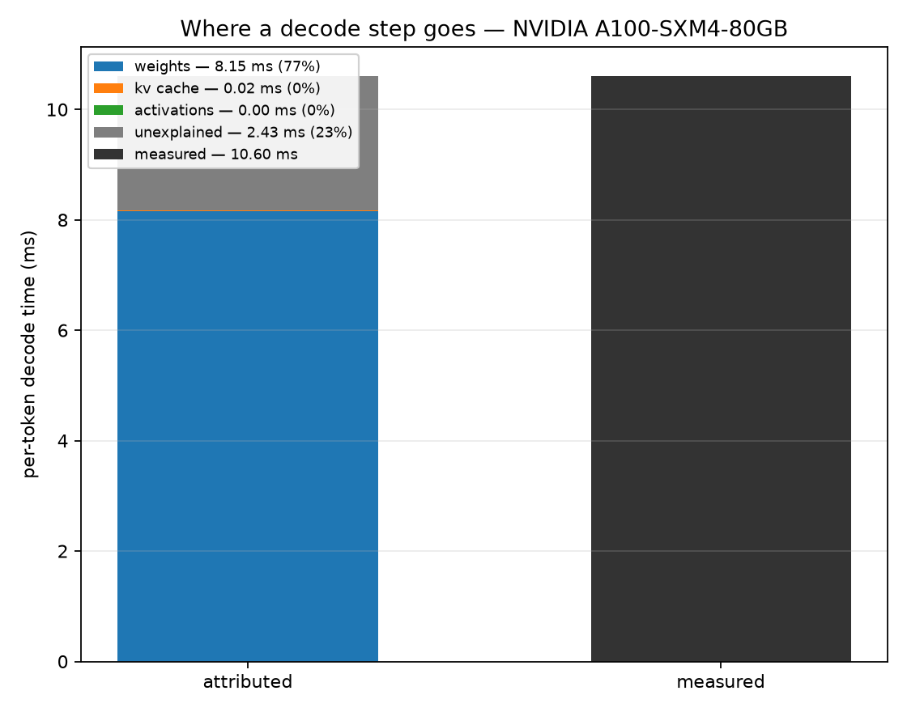
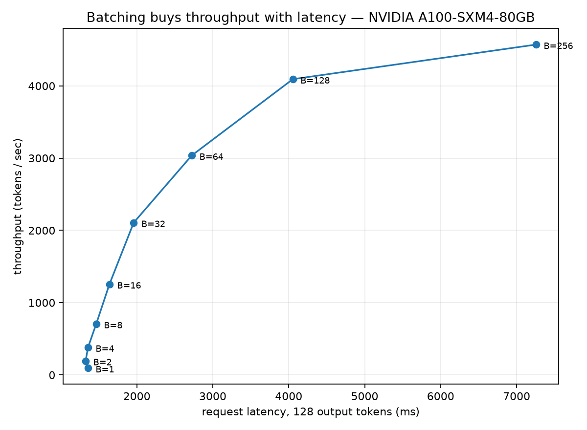
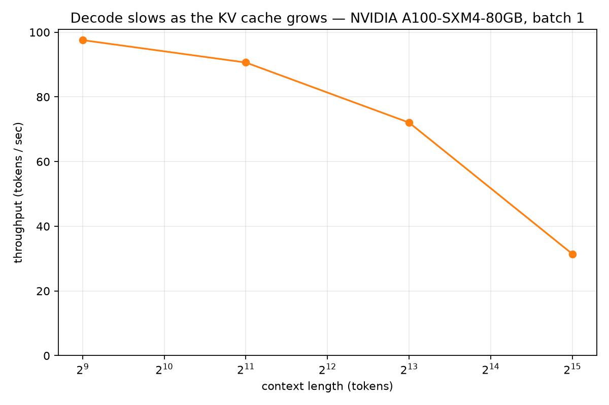

# T6 — Performance reasoning

**Question:** Can I predict an LLM's decode throughput from first principles, and account for every
token I don't get?

**Setup:** Qwen2.5-7B (7.62B params) in bfloat16 on an NVIDIA A100-SXM4-80GB, SM 1230 MHz /
memory 1593 MHz. System under test is **vLLM**, not a bare `transformers` loop. Context 512 unless
stated. Session `6c79f20d6c13`, shared with T7.

---

## Result



| | predicted | measured | verdict |
|---|---|---|---|
| decode throughput, batch 1 | 122.7 tok/s | **94.3 tok/s** | **1.30×** — WITHIN band (2.0×) ✓ |
| unexplained residual | ≤ 25% | **22.9%** | WITHIN ✓ |

Both bands were committed before the run, along with the arithmetic behind them.

**A 7B model decodes at 94 tokens/sec, and 77% of every step is one thing: reading 14.1 GB of
weights.** The KV cache is 0.2%. Activations round to zero. Everything else in the system — the
scheduler, the attention kernel, the sampler — shares the remaining 23%.

| term | ms | share | |
|---|---|---|---|
| weights | 8.15 | **76.9%** | 14.14 GB read once, at the session's streaming bandwidth |
| kv_cache | 0.02 | 0.2% | K and V for 512 past positions |
| activations | 0.00 | 0.0% | norms, residual adds, MLP intermediates |
| unexplained | 2.43 | **22.9%** | small-GEMV kernels below streaming bandwidth; attention; scheduling |
| **measured** | **10.60** | | |

The arithmetic that gets there:

| quantity | value | derivation |
|---|---|---|
| params read per token | 7.07 B | total minus the input embedding — a lookup, not a matmul |
| FLOPs / token | 14.14 GFLOP | `2P`: one multiply, one add per weight |
| bytes / token | 14.14 GB | `P × 2`: each weight read once |
| arithmetic intensity | **1.0 FLOP/byte** | `2 / bytes_per_param` |
| ridge point (measured) | 152 FLOPs/byte | decode sits **152× below it** |

## Effective bandwidth is the number worth remembering

**1,337 GB/s — 77% of the 1,735 GB/s a large streaming copy sustains on the same GPU in the same
session.**

That 23% shortfall *is* the residual, and it is not waste. A decode step is not one contiguous read;
it is a sequence of GEMV kernels against separate weight matrices. T7 measured the same effect
directly and independently: a large decode GEMV reaches 1,420 GB/s while a smaller one reaches only
744 GB/s. Weighting those two kernel classes by their share of the weights a decode step reads
predicts **1,341 GB/s** — against the **1,337** measured here, by a completely separate experiment.
That cross-check is enforced in CI, not just asserted in prose.

So the practical correction to the textbook estimate is a single constant:

> `tokens/sec ≈ 0.77 × bandwidth / bytes_per_token`

## CUDA graphs are worth a third of the step, and it gets worse with batch

Same engine, same kernels, same weights — `enforce_eager` flipped, nothing else.

| batch | graphs on | graphs off | overhead | share |
|---|---|---|---|---|
| 1 | 10.22 ms | 15.48 ms | 5.26 ms | **34.0%** |
| 8 | 10.42 ms | 16.73 ms | 6.31 ms | **37.7%** |
| 32 | 11.43 ms | 21.21 ms | 9.77 ms | **46.1%** |

**Launch overhead is not a fixed cost.** It grows with batch size — from a third of the step to
nearly half — which means it bites hardest exactly where you are trying to gain throughput. Without
graphs, batch 32 costs 9.77 ms per step in pure orchestration, more than the entire weight read.

## Batching: the knee is at 32–64, not at the memory limit



| batch | tok/s | step ms | request latency |
|---|---|---|---|
| 1 | 94.3 | 10.60 | 1,357 ms |
| 4 | 380.7 | 10.51 | 1,358 ms |
| 32 | 2,107.2 | 15.19 | 1,959 ms |
| 64 | 3,037.2 | 21.07 | 2,724 ms |
| 256 | 4,571.5 | 56.00 | 7,256 ms |

Batch 1 → 4 is **free**: step time is flat, so throughput quadruples at no latency cost — the
weights are read once no matter how many sequences share the read. After that each doubling returns
less: ×1.68 at 16→32, ×1.44 at 32→64, ×1.12 at 128→256.

Batch 256 buys **51% more throughput than batch 64 for 166% more latency.** For any
latency-sensitive product the knee is around 32–64, and it is nowhere near the point where memory
runs out.

Little's law holds exactly at every point — `throughput × latency` recovers the configured batch
size to within floating-point error, at all nine sizes.

## Long context is not a bandwidth problem



| context | tok/s | step ms | KV bytes/token |
|---|---|---|---|
| 512 | 97.6 | 10.25 | 29.4 MB |
| 2,048 | 90.6 | 11.03 | 117.4 MB |
| 8,192 | 72.1 | 13.88 | 469.8 MB |
| 32,768 | **31.4** | 31.80 | 1,879.0 MB |

**Decode is 3.1× slower at 32k context than at 512** — 10.25 ms per step becomes 31.80 ms. The
naive explanation is KV cache bandwidth. It is not:

| | value |
|---|---|
| measured slowdown | 21.55 ms |
| KV bytes read at 32k | 1.88 GB |
| that traffic at the effective 1,337 GB/s | **1.41 ms — 7% of the slowdown** |
| attention FLOPs/token at 32k | 13.15 GFLOP (**93% of the 14.14 GFLOP of weight matmuls**) |
| attention arithmetic intensity | 7.0 FLOPs/byte — still far left of the 152 ridge |
| **implied bandwidth of the attention path** | **87 GB/s = 5% of streaming** |

So attention at 32k does roughly as much arithmetic per token as every weight matmul combined, and
it is still memory-bound — but it moves its bytes at **5% of the rate the weight path achieves in
the same model on the same GPU.** Not "attention does more work". **Attention does comparable work
about 15× less efficiently.**

That is the sharpest open question these two topics leave, and it is well-posed: is it the paged-KV
layout defeating coalescing, kernel occupancy at long sequences, or something the differencing
method fails to isolate at this scale? Answering it needs a kernel-level profile, which is T8's
territory, not this harness's.

## Inference payoff

1. **`0.77 × bandwidth / bytes_per_token`** predicts single-stream decode within 30%. That is a
   back-of-envelope you can do in an interview.
2. **Weights are 77% of a decode step**, so weight-side optimisations — quantisation, sparsity,
   smaller models — dominate anything else you could do.
3. **Turn CUDA graphs on.** A third to a half of your step time, and the loss grows with batch.
4. **Batch to ~32–64, not to memory.** Past the knee you trade tail latency for throughput at a
   terrible exchange rate.
5. **Long context is an attention-kernel efficiency problem, not a KV-bandwidth problem.** Cache
   traffic explains 7% of the 32k slowdown; the attention path running at 5% of streaming bandwidth
   explains the rest. This is why FlashAttention and its successors exist, and why paged-KV layout
   choices are worth real engineering.

## What surprised me

- **I predicted the CUDA-graph gap would be 10–20%, on the record, before the run. It was 34–46%.**
  I reasoned that vLLM's eager path is already fused and well scheduled, so there would be few
  launches left to eliminate. Wrong: the overhead is not only launches but per-sequence scheduling
  work, which is why it *grows* with batch rather than staying fixed. Prediction registered, missed,
  and left standing.
- **The KV cache is almost irrelevant at 512 context** — 0.2% of a step. I expected single digits,
  not two orders below the weight term.
- **And it stays irrelevant at 32k.** I built the context sweep expecting to demonstrate KV
  bandwidth; it demonstrated the opposite. Cache traffic is 7% of the slowdown, and the attention
  path turns out to run at 5% of the bandwidth the weight path achieves in the same model. I
  expected to find a *quantity* problem and found an *efficiency* one.
- **The knee arrives early.** I expected batching to pay until memory pressure. It stops paying at
  32–64, an order of magnitude before the GPU runs out of anything.
- **77% effective bandwidth was the single most useful number produced**, and it came out of a
  line added almost as an afterthought.

## What is not measured

- **Request p50 and p99 are identical at every batch size.** Every request in a batch starts and
  finishes together here, so the latency distribution is degenerate by construction. These figures
  describe a synchronous batch, not a live serving queue with staggered arrivals — real tail latency
  needs a load generator, which this harness is not.
- **The activation term is an estimate**, not a profile. At 0.0% of the step it does not carry any
  argument.
- **One model, one GPU, one precision, one engine version.**
- **No quantisation, speculative decoding, or prefix caching** — each would move the headline number
  substantially.
- **The attention-path bandwidth figure is by elimination**, not direct kernel measurement: it is
  what remains after subtracting the weight and KV terms, so it also absorbs any error in those.
  The magnitude (5% of streaming, 15× worse than the weight path) is large enough to survive
  reasonable error in the subtraction, but it wants a profiler to confirm. Largest open question
  these topics leave.

## Reproduce

```bash
python -m arch_common.probe                                   # once per session, shared with T7
python -m topics.t06_perf_reasoning.predict --model Qwen/Qwen2.5-7B   # then COMMIT
python -m topics.t06_perf_reasoning.measure --model Qwen/Qwen2.5-7B --fresh --mode graphs
python -m topics.t06_perf_reasoning.measure --model Qwen/Qwen2.5-7B --mode eager
python -m topics.t06_perf_reasoning.decompose
python -m topics.t06_perf_reasoning.plot
```

The two modes run as separate processes deliberately: vLLM's engine-shutdown path imports CUDA
runtime libraries that need not match the installed torch, so building a second engine in one
process can crash *after* a completed measurement and destroy it.

The analytic half — parameter counts, byte counts, arithmetic intensity, the prediction itself —
runs anywhere with no GPU and is covered by tests. Only the measurement needs the hardware.

## Method notes

- **Per-step time is measured by difference.** Generating N tokens costs `prefill + N × step`, so
  timing 128 and 8 output tokens and dividing the difference cancels prefill, scheduler startup and
  detokenisation exactly. Dividing a single call by its token count folds prefill in and overstates
  the step.
- **`ignore_eos` forces every request to full length.** Without it, requests finish at staggered
  times, the batch shrinks as it runs, and the measurement silently becomes a mixture of batch sizes
  rather than the one under test.
- **The prediction is written to `results/predictions.json` before the measurement**, with both
  acceptance bands fixed at the same time. `tests/test_distinctness.py` asserts it is pinned to the
  same hardware session as the results it is judged against.

## Relationship to T7

T6 owns the **time** domain — whole model, real KV cache, wall-clock. T7 owns the **shape** domain —
isolated matmuls, FLOPs per byte, position against the ridge.

They corroborate each other twice, from opposite directions:

- **Effective bandwidth, to 0.31%.** T7 measures isolated synthetic GEMVs: 1,420 GB/s for a wide-N
  shape, 744 GB/s for a narrow-N one. Weighting those by their share of the weights a decode step
  actually reads — 88.4% wide (MLP, LM head) against 11.6% narrow (attention projections, K/V under
  GQA) — predicts **1,341 GB/s**. T6 measured **1,337 GB/s** from whole-model wall-clock. A
  synthetic-kernel benchmark and a production engine agreeing on the same quantity from opposite
  directions. The tightness is partly luck — a two-bucket model does not deserve three significant
  figures — so the CI check enforces it at a loose 15%.
- **Where batching stops paying.** T7 shows a single kernel's gains flatten as it crosses the ridge
  at 152 FLOPs/byte. T6 shows whole-model throughput flattening over the same range. Same
  conclusion, one from kernel shapes and one from wall-clock.

`tests/test_distinctness.py` fails CI if the metric vocabularies overlap, if either topic strays
into the other's domain, or if the two were measured in different sessions.
