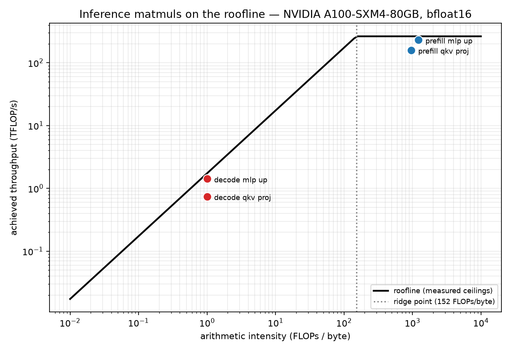
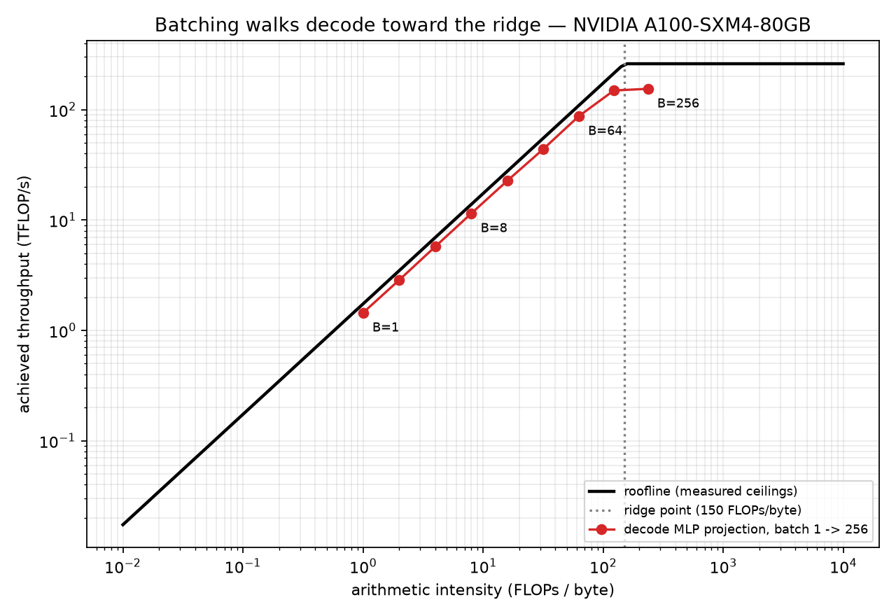

# T7 — Roofline and arithmetic intensity

**Question:** Where do real inference matmuls sit on my GPU's roofline, and what moves them?

**Setup:** NVIDIA A100-SXM4-80GB, bfloat16, SM clock 1215 MHz / memory 1593 MHz, torch 2.8.0+cu128.
Qwen2.5-7B's dimensions (hidden 3584, intermediate 18944); **no weights are ever loaded** — every
measurement is a synthetic tensor of the right shape. Session `ea734b39914c`, shared with T6 and T8.

---

## Result



**Decode runs at 0.5% of the GPU's compute — and that is near-optimal, not wasteful.**

The decode MLP projection reaches 1.42 TFLOP/s against a 260.4 TFLOP/s ceiling. But the ceiling it
is actually under is the *memory* roof, which at 1.0 FLOP/byte is `1736.7 GB/s × 1` = **1.74
TFLOP/s**. It hits **82% of that.** The kernel is running nearly as fast as the hardware permits;
the hardware simply does not permit much when each byte is used once.

That distinction — "underutilised" versus "memory-bound" — is the entire reason to draw a roofline.

### The two ceilings, measured

| | measured | A100 spec | achieved |
|---|---|---|---|
| memory bandwidth | **1,736.7 GB/s** | 2,039 | 85% |
| compute (bf16) | **260.4 TFLOP/s** | 312 | 83% |
| **ridge point** | **149.9 FLOPs/byte** | | |

Both ceilings land within a point of 85% of the marketing figure. Quoting the spec sheet would
have shifted every conclusion by the same 15%.

Peak is also strongly **shape**-dependent, which is why the whole sweep is reported:

| square GEMM | 1024 | 2048 | 4096 | 8192 | 16384 |
|---|---|---|---|---|---|
| TFLOP/s | 55.8 | 125.4 | 218.3 | 242.9 | **260.4** |

A 1024² matmul reaches **21%** of what a 16384² one does on identical silicon. "Peak FLOP/s"
measured at one arbitrary size is not a hardware property.

### The two regimes

| shape | AI (FLOPs/byte) | TFLOP/s | % of peak | bound by |
|---|---|---|---|---|
| prefill MLP up-projection | 1,219 | 230.9 | **88.7%** | compute |
| prefill QKV projection | 956 | 158.2 | 60.8% | compute |
| decode MLP up-projection | 1.0 | 1.42 | 0.5% | memory |
| decode QKV projection | 1.0 | 0.71 | 0.3% | memory |

Same weights, same model, **three orders of magnitude apart in arithmetic intensity** and on
opposite sides of the ridge. Prefill is a different machine from decode.

**Pre-registered band:** best prefill shape ≥ 70% of measured peak → **WITHIN (88.7%)** ✓

## Batching walks decode to the ridge, and then stops paying



| batch | AI | TFLOP/s | implied GB/s |
|---|---|---|---|
| 1 | 1.0 | 1.44 | 1,444 |
| 8 | 8.0 | 11.5 | 1,437 |
| 64 | 62.7 | 87.1 | 1,390 |
| 128 | 122.8 | 149.0 | 1,213 |
| 256 | 236.0 | 154.4 | 654 |

**Batch 1 → 128: throughput ×103. Batch 128 → 256: ×1.04.**

The `implied GB/s` column is the mechanism, and it is the most useful number here. From batch 1 to
64 it is **pinned at ~1,390–1,444 GB/s** — the kernel is bandwidth-saturated the entire way up, and
every doubling of batch buys a near-doubling of throughput for free, because the weights are read
once regardless. Batch 256 is the first point whose intensity (236) exceeds the ridge (150); it has
crossed into compute-bound territory, bandwidth utilisation collapses to 654 GB/s, and the gains
stop dead.

Continuous batching is not a heuristic. It is the exploitation of a flat line on this plot, and it
runs out at a point the hardware fixes in advance.

## Inference payoff

1. **Decode is memory-bound by two orders of magnitude** (AI 1.0 vs ridge 150). Buying FLOP/s to
   speed up decode is buying the wrong thing.
2. **Quantisation is a bandwidth optimisation, not a compute one.** AI = `2/bytes_per_param`, so
   int8 doubles arithmetic intensity and int4 quadruples it — it moves the point rightward, which
   is the only direction that helps. **T8 builds that kernel and measures what the move actually
   costs**, which turns out to be more than this arithmetic suggests.
3. **Batch until the ridge, then stop.** The ceiling is `peak_FLOPs / bandwidth` and it is knowable
   before you run anything.
4. **Prefill and decode should be scheduled as different workloads** — one saturates compute, the
   other saturates memory. Disaggregated prefill/decode serving is this table, productised.
5. **Compute-bound is necessary but not sufficient.** Both prefill shapes cleared the ridge; one
   reached 87.8% of peak and the other 60.4%.

## What surprised me

- **The QKV projection got 60.8% where the MLP got 88.7%** — same regime, same hardware, both
  firmly compute-bound. The difference is shape: 3584 output columns tile onto the SMs worse than
  18944. I had assumed "compute-bound" was the end of the analysis; it is the beginning of one.
- **The same effect appears in decode**, larger: 1,419 GB/s for the MLP projection versus 712 GB/s
  for QKV. A 2× spread between two kernels in the same layer of the same model.
- **The implied-bandwidth column was an afterthought** and turned out to be the strongest evidence
  in the topic — a flat ~1,400 GB/s across six batch sizes says "bandwidth-saturated" far more
  convincingly than any single point could.
- **Both ceilings landing within two points of 85% of spec** (85% and 83%) is a coincidence, but a
  useful one for remembering roughly what a datasheet is worth.
- **The GEMM sweep spans 4.7×.** I expected shape sensitivity; I did not expect the small end to be
  barely a fifth of the large end.

## What is not measured

- **Attention's own QK^T and AV matmuls are excluded.** Their cost scales with sequence length
  rather than with weights, so they belong to a separate analysis.
- **Analytic intensity is a lower bound on traffic** — real kernels re-read tiles that miss in L2,
  so true intensity is slightly worse and every point sits marginally left of where it is drawn.
- **Dense bf16 only.** No quantised or sparse kernels, so claim 2 above is arithmetic, not
  measurement.
- **One GPU, one session.** No claim about other hardware.
- **Isolated kernels, not a running model.** What the rest of a system does to these numbers is
  T6's question, not this one.

## Reproduce

```bash
python -m arch_common.probe            # once per session — shared with T6
python -m topics.t07_roofline.measure
python -m topics.t07_roofline.plot
```

Rehearsal on any laptop, seconds, no GPU:

```bash
python -m arch_common.probe --device cpu
python -m topics.t07_roofline.measure --device cpu --hidden 512 --intermediate 1024 \
    --prefill-tokens 128
```

On a CPU every shape lands *right* of the ridge — little compute relative to bandwidth puts the
ridge near 0.05 rather than 152, and the batch walk comes out flat. That is the correct physics for
that machine, and a useful check that the plot reads real measured ceilings rather than hardcoded
GPU constants.

## Relationship to T6

T7 owns the **shape** domain: isolated kernels, FLOPs per byte, position against the ridge — no
clock on either axis, no weights on disk. T6 owns the **time** domain: whole model, real KV cache,
tokens per second.

Both read their ceilings from the same `results/hardware.json`, so the two notes cannot end up
quoting different roofs for the same GPU. `tests/test_distinctness.py` fails CI if the metric
vocabularies overlap, if either topic strays into the other's domain, or if the two were measured
in different sessions.

### The kernels predict the whole model to 0.3%

T7's two decode measurements are of **isolated synthetic tensors** — no model, no cache, no
scheduler. Weight them by their share of what a real decode step reads:

| kernel class | share of weights read | T7 measured |
|---|---|---|
| wide-N (MLP 18944, LM head 152064) | 88.4% | 1,420 GB/s |
| narrow-N (attention 3584, K/V 512) | 11.6% | 744 GB/s |
| **weighted prediction** | | **1,341 GB/s** |
| **T6 measured, whole model, wall-clock** | | **1,337 GB/s** |

**0.31% apart.** A synthetic-kernel benchmark and a production inference engine, agreeing on the
same physical quantity from opposite directions.

Treat that as order-of-magnitude confirmation rather than precision: a two-bucket model of a
transformer's matmuls does not deserve three significant figures, and the tightness here is partly
luck. `tests/test_distinctness.py` enforces the check at a deliberately loose 15%, so it keeps
catching a genuinely broken topic without failing on the next model or GPU.

The two batch sweeps are the one genuine near-collision, and they measure different things on
purpose: **T7 sweeps the matmul shape in isolation** — no model, no cache, pure kernel. **T6 sweeps
the whole model with a real cache.** T7 shows the kernel reaching toward the ridge; T6 shows what
the rest of the system does to that gain.
