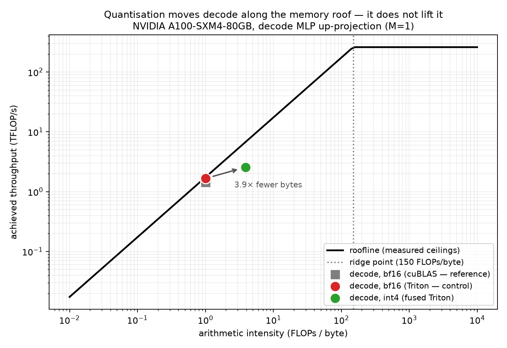

# T8 — GPU architecture: buying back decode throughput

**Question:** Decode is bandwidth-bound (T7). If I make it read **4× fewer bytes**, do I get 4× the
tokens — and if not, what ate the difference?

**Setup:** *(filled in from the run)* NVIDIA A100-SXM4-80GB, SM clock ___ MHz / memory ___ MHz,
torch ___, Triton ___. Qwen2.5-7B's decode MLP up-projection (N=18944, K=3584), synthetic weights —
as in T7, the byte budget depends on the shape, not the values.

**Sessions, stated honestly.** T6 and T7 share session `6c79f20d6c13`, and a cross-topic test
enforces that. T8 runs on a **later** session `___`, so it is not covered by that guarantee. What
crosses the session boundary is the *ratio* 76.9% — a property of the model's parameter count
against its non-weight work, which is stable across pods — while T6's absolute **94.3 tok/s is
not**. Hence: the kernel result below is measured in T8's own session against T8's own roof, and
the tokens/sec projection is explicitly a cross-session estimate.

---

## Result



> **HEADLINE — write after the run.** The shape it will take: *the kernel got ~Nx, the end-to-end
> decode got ~Mx, and the difference is Amdahl on the 23% of the step that was never weight
> traffic.* State the number that surprised you, not the one you predicted.

### What was committed before running

Every term comes from an earlier topic. Nothing here was fitted after the fact — the numbers below
were written to `results/predictions.json` by `measure.py --skip-kernel` before the kernel ran.

| term | value | source |
|---|---|---|
| bytes/param, bf16 | 2.000 | — |
| bytes/param, int4 g128 | **0.516** | `pack.py`, measured off the allocated tensors |
| byte ratio | **3.88×** | the kernel's ceiling — it cannot beat this |
| weight share of a decode step | **76.9%** | T6's error budget, read from `t06/results/perf.csv` |
| **predicted end-to-end** | **2.33×** | Amdahl (T5): `1 / (0.769/3.88 + 0.231)` |
| predicted decode | 94.3 → **~220 tok/s** | T6's measured baseline × the above |

**Pre-registered bands:** kernel ≥ 75% of the byte ratio · cosine ≥ 0.99 (T1's int4-g128 result) ·
end-to-end within ±25% of 2.33×.

### Measured

*(table from `results/int4.csv`)*

| kernel | ms | GB/s | % of measured roof |
|---|---|---|---|
| bf16 torch | | | |
| int4 fused | | | |

| band | predicted | measured | verdict |
|---|---|---|---|
| kernel speedup | 3.88× ceiling | | |
| cosine vs fp32 | ≥ 0.99 | | |
| end-to-end | 2.33× | | |

---

## Why the dequantisation has to live inside the kernel

The obvious version of this — store int4, call `dequantise()`, hand the result to `torch.matmul` —
saves nothing at all. It writes a full-width bf16 matrix to HBM and then streams it straight back,
so the traffic is bf16 traffic *plus* the int4 read. Compression only pays if the expansion happens
after the load, in registers, and the expanded weight never leaves the SM.

That is the entire content of the word "fused", and it is the difference between a 3.9× win and a
regression. `int4_gemv_reference` in `kernel.py` is deliberately the unfused version, kept as the
correctness oracle precisely because it is the thing the fused kernel exists not to be.

## Why this kernel uses no tiling, no shared memory and no tensor cores

At M=1 there is no reuse to exploit. Every weight is loaded once, multiplied once, discarded.
Shared-memory staging, register tiling and `tl.dot` all exist to amortise a load across a tile of
outputs — and with a single output column there is nothing to amortise. `tl.dot` never appears in
this file.

That is worth saying plainly because it inverts the usual GPU-kernel lesson. The A100's 312 TFLOP/s
and its tensor cores are irrelevant to decode. Writing the kernel is how that stops being a fact you
have read and becomes one you have hit.

## The layout is chosen for the consumer

Two int4 codes share a byte. The obvious packing pairs adjacent columns `2j` and `2j+1`, which
forces the kernel to interleave two half-width vectors back into column order on every single load.
So instead column `j` is paired with column `j + K/2`: the low nibbles are then exactly the first
half of the row and the high nibbles exactly the second, both already in order, and the kernel runs
two independent accumulations against two contiguous slices of `x` with no shuffling at all.

This is the sort of decision that never appears in the maths and dominates the kernel.

## What surprised me

*(honest reflection — negatives welcome. Candidates, delete what did not happen:)*

- the shortfall between the byte ratio and the measured kernel speedup, and what it turned out to be
- how little the 3.88× bought end-to-end once Amdahl applied
- the per-element scale loads mattering more / less than expected
- autotune picking a `BLOCK_N` far from the one that seemed obvious

## Caveats & reproduce

- **One shape, one GPU, one model's dimensions.** The MLP up-projection only; attention's QK^T and
  AV matmuls scale with sequence length rather than with weights and belong to a different analysis.
- **Synthetic weights.** Accuracy here is measured against the *unquantised synthetic* tensor, so it
  validates the kernel, not the model. T1 is where int4's accuracy on a real Qwen weight was
  established; this topic inherits that result rather than re-deriving it.
- **The end-to-end number is a projection**, computed from T6's error budget — not a re-run of vLLM
  with an int4 kernel spliced in. Labelled as modelled wherever it appears.
- **Scales are loaded per element, not per group** — a known inefficiency, left in for readability.
  Its cost is instructions and latency, not bandwidth, which is the budget being measured.

```bash
uv sync
uv run python -m arch_common.probe          # once per session; T6/T7/T8 share the profile
make t8-predict                             # prediction only — no GPU needed
make t8                                     # measure + plot (CUDA + Triton)
uv run pytest topics/t08_gpu_architecture   # packing tests run anywhere; kernel tests need CUDA
```

The prediction is fully derived — `bytes/param` off the allocated tensors, `weight_share` read live
from T6's CSV — so `make t8-predict` reproduces the table above on any machine, with no GPU and no
numbers copied by hand:

```
  bytes/param  2.000 bf16 -> 0.516
  byte ratio   3.88x           <- the kernel's ceiling
  weight share 76.9%           <- T6 error budget
  end-to-end   2.33x           <- Amdahl (T5)
  decode       94.3 -> 219.7 tok/s
```
