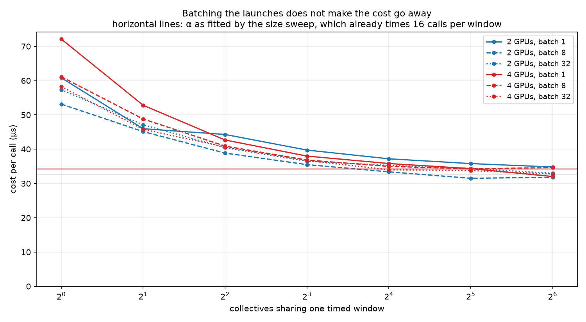
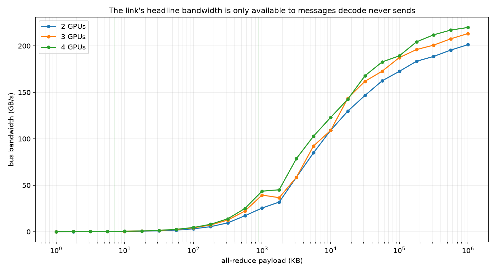
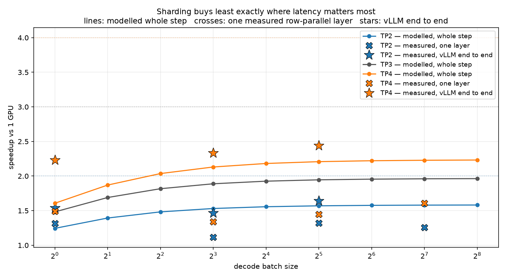

# T9 — Interconnects: what a collective costs when the message is small

**Question:** T5 measured tensor parallelism end to end and found that its communication *volume*
does not explain its cost — 940 MB per step is only ~4% of the step at NVLink bandwidth, yet TP
scaled worst of the three dense strategies. T5 called the loss "frequency and shape" rather than
volume. **So what does one all-reduce actually cost, how much of that cost is there before it moves
a single byte, and what is that fixed cost made of?**

**Setup:** 4× NVIDIA A100-SXM4-80GB, **NV12 NVLink between every pair** (12 bonded links), NCCL
2.27.3, torch 2.8.0+cu128, vLLM 0.11.0, bfloat16. Measured memory bandwidth **1,736.9 GB/s** — T6,
T7 and T8 ran at 1,737 GB/s, so this is the same silicon to within 0.1% and the numbers below
compose with theirs directly. Session `bdd8eeb753e5`. Model shape throughout is Qwen2.5-7B (hidden
3584, 28 layers), as in T5–T8.

---

## Result


**A decode all-reduce is 99.9% fixed cost, that fixed cost has almost nothing to do with the
interconnect, and it is paid on the device rather than on the host.**

A collective is priced as `t(n) = α + n/β`. Fitted on this node, three world sizes, three repeats
each:

| | α (fixed) | α across 3 repeats | β (bandwidth) | R² (ramp) | crossover | β vs NV12 spec |
|---|---|---|---|---|---|---|
| 2 GPUs | **33.95 µs** | 32.52 – 34.85 | 202.6 GB/s | 0.9997 | 6,717 KB | 67.5% |
| 3 GPUs | **32.73 µs** | 32.63 – 37.50 | 214.5 GB/s | 0.9997 | 5,143 KB | 71.5% |
| 4 GPUs | **34.49 µs** | 33.80 – 36.00 | 221.8 GB/s | 0.9999 | 4,980 KB | 73.9% |

Decode at batch 1 sends **7,168 B**. That is ~700× below the crossover, so on 4
GPUs the call costs 34.54 µs of which **99.9% is α**. It achieves **0.311 GB/s of bus bandwidth —
0.14% of the 221.8 GB/s the same link delivers to a large message.**

Fifty-six of those per token (2 per layer × 28 layers) is **1.93 ms**, against T6's measured 11.05 ms
step: a **17.5% tax** on a step that tensor parallelism is supposed to be shrinking.

| pre-registered band | predicted | measured | verdict |
|---|---|---|---|
| 1. α(4)/α(2), from ring `2(N-1)` | 3.0 ± 30% | **1.02** | **OUTSIDE** ✗ |
| 2. β vs NV12 spec, world 2 | ≥ 70% | 67.5% | **OUTSIDE** ✗ |
| 2. β vs NV12 spec, world 3 | ≥ 70% | **71.5%** | WITHIN ✓ |
| 2. β vs NV12 spec, world 4 | ≥ 70% | **73.9%** | WITHIN ✓ |
| 3. batch-1 call is fixed cost | ≥ 90% | **99.9%** (all worlds) | WITHIN ✓ |
| 4. model vs real TP layer, world 4 | within 1.5× | 0.83–1.10× | WITHIN ✓ |
| 4. model vs real TP layer, world 2 | within 1.5× | **0.49–0.67×** | **OUTSIDE** ✗ |

Three of seven failed, and the failures were worth more than the passes. Band 1 is where the topic's
actual finding is; band 4's world-2 failure is where the microbenchmark got caught flattering
itself, and it is now resolved rather than left open.

---

## Band 1: α did not scale, and the ring explains 9% of why

The ring model says an all-reduce costs `2(N-1)` dependent hops, so going 2 → 4 GPUs should triple
the fixed cost. It barely moved: **33.95 → 34.49 µs, a ratio of 1.02.**

The first session measured two world sizes and solved `α = L + 2(N-1)·h` for the floor and the
per-hop term. Two equations, two unknowns — the solution was exact and therefore untestable. **A
third world size makes it a fit with a residual**, which is the whole reason 3 GPUs is in the run:

    α(N) = 33.19 µs + 2(N-1) × 0.135 µs        R² = 0.0895, 3 world sizes

| | measured α | model | hops' share |
|---|---|---|---|
| 2 GPUs | 33.95 µs | 33.46 µs | 0.81% |
| 3 GPUs | 32.73 µs | 33.73 µs | 1.60% |
| 4 GPUs | 34.49 µs | 34.00 µs | 2.38% |

**R² = 0.089 is the honest headline: hop count explains about 9% of the variation in α.** The other
91% is a floor that does not care how many GPUs are in the ring. And the noise floor makes the same
point without any model at all — α spans **1.76 µs across three world sizes**, while the same world
size re-measured three times spans **2.33, 4.87 and 2.19 µs**. *The spread across repeats exceeds
the spread across world sizes.* Whatever the ring costs here, it is smaller than run-to-run
variation.

The obvious suspicion is that NCCL wasn't running a ring at all — it switches to tree algorithms for
small payloads on some topologies. So I asked it, with `NCCL_DEBUG=INFO NCCL_DEBUG_SUBSYS=TUNING`
(full capture in [`results/nccl_algo.txt`](results/nccl_algo.txt)):

```
AllReduce:             4 Bytes -> Algo RING proto LL     channel{0..0}
AllReduce:         1,820 Bytes -> Algo RING proto LL     channel{0..0}
AllReduce:        18,208 Bytes -> Algo RING proto LL     channel{0..0}
AllReduce:       182,092 Bytes -> Algo RING proto LL     channel{0..9}
AllReduce:     1,820,956 Bytes -> Algo RING proto LL128  channel{0..22}
AllReduce:    18,209,580 Bytes -> Algo RING proto SIMPLE channel{0..23}
AllReduce: 1,023,999,996 Bytes -> Algo RING proto SIMPLE channel{0..23}
```

**Observed:** it is a ring at every size — the algorithm was never the issue. What changes is the
protocol and the channel count. The node has 24 collective channels, and a decode-sized message uses
**one of them**.

**Inferred, and flagged as inference:** that single channel is *consistent with* α being flat,
because a one-channel low-latency handshake has no reason to get more expensive as the ring gets
longer. The capture does not prove the causal link — it rules out the tree-algorithm explanation and
shows what NCCL chose. What follows is the measurement that does test the mechanism.

### What α is actually made of

The first session's note said α was "launch and synchronisation". That was half wrong, and the fix
is the most important correction in this topic.

Host-side dispatch is paid once per call *on the CPU*, and it overlaps with the device executing the
previous call. So issuing N collectives back to back inside one timed window hides all but the first
one's dispatch. If α is host launch cost, per-call time must collapse as N rises. If α is
device-side — protocol synchronisation, flag exchange, the LL protocol's own handshake — batching
the launches changes nothing, because each call still has to happen on the GPU in sequence.



| calls per window | 1 | 2 | 4 | 8 | 16 | 32 | 64 |
|---|---|---|---|---|---|---|---|
| 2 GPUs, batch 1 (µs/call) | 60.83 | 45.97 | 44.30 | 39.74 | 37.20 | 35.80 | 34.81 |
| 4 GPUs, batch 1 (µs/call) | 72.13 | 52.82 | 42.68 | 37.99 | 35.82 | 34.34 | 32.03 |

The curve falls by roughly half and then **flattens above zero**, onto the α the size sweep reports
(~32–35 µs). That plateau is the result: **a per-call cost that batching the launches cannot remove
is not launch cost.** α is predominantly device-side, and the only way to stop paying it is to not
make the call.

The headline follows directly, because `measure.py` already times 16 back-to-back calls per window:
**the α quoted throughout this note is already an amortised-launch number.** Host dispatch had been
excluded before this sweep was written, and the first session's phrase "launch and synchronisation"
was carrying an implication its own method had already ruled out.

Three limits, stated rather than smoothed over:

- **The falling half of the curve is not all dispatch.** Timing uses CUDA events recorded on the
  stream, so the event pair brackets device work; at inner=1 each pair contains a single collective
  that has just re-synchronised with its peers after an unmeasured host-side gap, and at inner=64
  the ranks are already in lockstep. Host dispatch and rank re-synchronisation both shrink as calls
  are batched, and **this sweep cannot separate them.** It does not need to: the claim rests on the
  plateau's height, not on the descent's cause.
- **The curve has not fully converged at 64.** Per-call cost at inner=16 is 6.9% (2 GPUs) and 11.8%
  (4 GPUs) above its value at inner=64. Read that as an **upper bound** on what is still amortisable
  in the headline α, not as a measured residue — a longer sweep would tighten it.
- **Run-to-run variation is the same size.** The launch module's own inner=16 point (37.20 µs at 2
  GPUs) sits ~9% above the size sweep's α (33.95 µs) for the same collective in a different process.
  That gap is of the same order as the residue, which is exactly why the claim is "predominantly
  device-side" and not a percentage split.

### 34 µs is high against published small-message figures, and I did not close that gap

An expert reading "34 µs for a 7 KB all-reduce on NVLink" will note that `nccl-tests` typically
reports considerably lower small-message latencies on comparable hardware. **That comparison was not
run on this pod, and this topic does not explain the difference.** Saying so is more useful than
guessing, so here is what it is and is not.

What this measures is one `torch.distributed.all_reduce` on one CUDA stream, timed with CUDA events
around 16 back-to-back calls — so it includes torch's `c10d` and `ProcessGroupNCCL` path per call,
not just `ncclAllReduce`, and it includes whatever rank skew a barrier-shaped operation accumulates
between four processes. Either could account for part of the gap; a like-for-like `nccl-tests` run
on the same node is the missing measurement, and it is the first thing I would add.

**What does not depend on the absolute offset:** every structural result here is a *ratio* or a
*shape*. α being flat across world size, decode being 99.9% fixed cost, the crossover landing ~700×
above decode's payload, the fixed cost amortising with batch — all of these are internal
comparisons within one harness, and a constant offset in that harness moves none of them. The number
to be careful with is the **17.5% decode tax**, which is an absolute quantity composed with T6's
absolute step time; read it as an upper bound for a naive `torch.distributed` implementation, which
is exactly what the vLLM measurement below then confirms it is.

The serialisation, at least, is deliberate and faithful: layer N+1's all-reduce cannot start until
layer N's has finished, 56 times per token. Decode does not get to pipeline these.

**This is the same lesson as T8, on different hardware.** T8 found a batch-1 GEMV bound by work per
weight rather than by bytes. Here a collective is bound by per-call fixed cost rather than by the
wire. Decode makes every operation small, and small operations are priced by their fixed costs —
which is also the hypothesis T11 will test directly on kernel launches.

## Band 2: the link is not the constraint either



β reaches 67.5% of NV12's spec at 2 GPUs, 71.5% at 3 and 73.9% at 4. The 2-GPU number misses the
band.

**The denominator is 300 GB/s, and that is the *unidirectional* figure**: 12 links × 25 GB/s each
way. NVIDIA markets NV12 as 600 GB/s, which is the bidirectional sum — quoting β against that would
halve every percentage here and would be comparing a one-way rate to a two-way one. `bus_gbps` also
already contains the ring's `2(N-1)/N` factor, so these are bus-bandwidth numbers in the same
convention `nccl-tests` uses.

Worth noting the direction: **more GPUs achieve *more* bus bandwidth, monotonically**, which is the
opposite of the naive expectation that a longer ring is worse. Bus bandwidth already contains the
`2(N-1)/N` factor, so a wider ring genuinely uses more of the fabric — with two GPUs there are
simply fewer paths in play. The band's denominator is a datasheet figure, and 67% vs 74% of it is a
much smaller story than the ~700× separating decode's payload from the crossover where β begins to
matter at all.

## What this predicts for tensor parallelism

Amdahl with a communication penalty, using T6's measured error budget (weight share **73.7%**, step
**11.05 ms**, **90.5 tok/s**), read from `t06/results/perf.csv` at runtime rather than retyped:

    speedup = 1 / ( (1-w) + w/N + comms_per_token/step )

| batch | comms/token, TP2 | TP2 | comms/token, TP4 | TP4 |
|---|---|---|---|---|
| 1 | 1,903 µs | **1.24×** | 1,934 µs | **1.61×** |
| 8 | 240 µs | 1.53× | 244 µs | 2.13× |
| 32 | 61 µs | 1.57× | 63 µs | 2.21× |
| 128 | 16.8 µs | 1.58× | 17.8 µs | 2.23× |



Two things fall out, and they point in opposite directions from the pre-registered story:

**Sharding wider is nearly free in latency terms.** I predicted TP4 would be punished because α
would triple. It doesn't, so TP4 beats TP2 at every batch size. The prediction registered before the
run said 1.49× and 1.76×, from an assumed α of 8 µs; the measured α of ~34 µs makes batch 1 *worse*
than predicted at TP2 and *better* at TP4, because the assumed model had the world-size scaling
backwards.

**Batching is what pays for the collectives.** The fixed cost is per call, not per token, so it
amortises: 1,903 µs/token at batch 1 becomes 16.8 µs at batch 128. TP2 goes 1.24× → 1.58× on that
alone. Same conclusion T6 and T7 reached by different routes — batch first.

These are **modelled**. Two measured checks follow: one layer, then the whole engine.

## Band 4: measured on a real layer, and the anomaly is resolved

The fit above comes from an all-reduce running alone, with nothing else on the GPU and the same
buffer every time — the cleanest possible setting and therefore the most flattering. Stage 3 runs the
actual thing: a row-parallel down-projection (K=18944, N=3584, T7 and T8's shape), taking the
collective's cost as *step with it* minus *step without it*.

Against the fitted model:

| | b1 | b8 | b32 | b128 |
|---|---|---|---|---|
| world 4, measured/predicted | 1.10× | 1.02× | 1.01× | 0.83× |
| world 2, measured/predicted | **0.66×** | **0.49×** | **0.54×** | **0.67×** |

**At 4 GPUs the microbenchmark predicts a real layer's communication to within 10% at batches 1–32,
and over-predicts by 17% at batch 128** — where the matmul has finally grown longer than the
collective (38.4 µs against 35.0 µs), so a little of it starts to hide, in the same direction and for
the same reason as world 2. At 2 GPUs the model over-predicts by roughly a factor of two throughout:
the collective inside real work is *faster* than the same collective measured alone.

The first session left two explanations standing and refused to pick one: either the all-reduce
partly **overlaps** the matmul (so the difference method under-attributes it), or the sweep's
isolated measurement is **not comparable across processes**, buffers and communicators. This session
added the control that separates them: time the same buffer's all-reduce **alone, in the same
process, immediately alongside the layer**.

| | matmul | comms in situ | comms alone | alone / in situ | comms share of step |
|---|---|---|---|---|---|
| 2 GPUs, b1 | 51.6 µs | 22.3 µs | **35.4 µs** | 1.59× | 30.2% |
| 2 GPUs, b8 | 68.3 µs | 16.8 µs | **33.2 µs** | 1.98× | 19.9% |
| 2 GPUs, b32 | 57.3 µs | 18.9 µs | **34.8 µs** | 1.84× | 24.9% |
| 2 GPUs, b128 | 66.0 µs | 25.7 µs | **35.2 µs** | 1.37× | 28.1% |
| 4 GPUs, b1 | 27.5 µs | 38.1 µs | **36.0 µs** | 0.95× | 58.4% |
| 4 GPUs, b8 | 35.0 µs | 35.5 µs | **33.5 µs** | 0.94× | 50.7% |
| 4 GPUs, b32 | 36.8 µs | 36.4 µs | **33.9 µs** | 0.93× | 52.6% |
| 4 GPUs, b128 | 38.4 µs | 33.7 µs | **35.0 µs** | 1.04× | 47.0% |

**`alone` reproduces the sweep's α (33–36 µs) at both world sizes.** The cross-process explanation is
dead: the isolated sweep was measuring the same thing this process measures. What is left is
overlap — and the mechanism is visible in the same table. At 2 GPUs each rank's matmul is 52–68 µs,
*longer* than the ~34 µs collective, so there is room to hide it; at 4 GPUs the matmul is 28–38 µs,
comparable or shorter, and there is not. Overlap ratio > 1 exactly where the matmul is long enough,
≈ 1 exactly where it isn't.

So band 4's world-2 failure is **not a broken model — it is the difference method correctly
attributing less to a collective that partly runs for free.** The band still reads OUTSIDE, because
it was registered against a tolerance and honesty about pre-registration is the point, but the cause
is now measured rather than shortlisted.

## The end-to-end check: vLLM beats the model, and the logs say why

The TP speedups above are modelled, and the model is deliberately optimistic — it holds the
non-weight 26% fixed under sharding, which T5 measured to be false. It should over-predict. Stage 4
stops arguing and runs the real engine: the same vLLM T6 measured, with `tensor_parallel_size` set,
using T6's differencing method to isolate a decode step from prefill.

| TP | batch | step | tok/s | measured | modelled | model / measured |
|---|---|---|---|---|---|---|
| 1 | 1 | 11.12 ms | 89.9 | — | — | — |
| 1 | 8 | 14.65 ms | 546.1 | — | — | — |
| 1 | 32 | 24.70 ms | 1,295.5 | — | — | — |
| 2 | 1 | 7.22 ms | 138.5 | **1.54×** | 1.25× | 0.81× |
| 2 | 8 | 9.99 ms | 800.8 | 1.47× | 1.54× | 1.05× |
| 2 | 32 | 15.06 ms | 2,125.5 | 1.64× | 1.58× | 0.96× |
| 4 | 1 | 4.99 ms | 200.5 | **2.23×** | 1.61× | 0.72× |
| 4 | 8 | 6.27 ms | 1,275.4 | 2.34× | 2.16× | 0.92× |
| 4 | 32 | 10.12 ms | 3,162.0 | 2.44× | 2.22× | 0.91× |

Two results here, and the first is a free validation of the whole chain:

**TP1 batch 1 reproduces T6.** 11.12 ms / 89.9 tok/s here against T6's 11.05 ms / 90.5 tok/s —
**0.6% apart, on a different rented pod, weeks later.** T6's step time is the denominator of this
topic's decode tax, so it is worth knowing it is not a one-pod artefact.

**The model under-predicts at batch 1, by 19% at TP2 and 28% at TP4 — and it under-predicts because
vLLM does not pay the α this topic measured.** That is not a guess; the engine says so in its own
startup log:

```
disable_custom_all_reduce=False                       # vLLM's own all-reduce kernel, not NCCL's
SymmMemCommunicator: Device capability 8.0 not supported, communicator is not available.
custom_all_reduce.py:203  Registering 5814 cuda graph addresses
cudagraph_mode: [2,1], use_cudagraph: true            # and the decode step is captured FULL
```

So at decode sizes vLLM routes around both halves of the cost: a **custom one-shot all-reduce** in
place of NCCL's ring protocol, and a **CUDA-graph-captured step**, which removes the per-call
dispatch path outright rather than merely hiding it behind the previous call as batching does. The
`SymmMem` line rules out the other candidate — on A100 (capability 8.0) the symmetric-memory path is
unavailable, so it is the custom kernel doing the work.

The right reading of the modelled table is therefore: **`α + n/β` with NCCL's α is an upper bound on
the cost of a naive tensor-parallel implementation, not on a production engine.** The gap between
them, largest exactly at batch 1, is the measure of how much engineering serving frameworks put into
this specific problem. That is the useful conclusion, and it only exists because the model was
written down first and then measured against.

## Why this is not T5 again

Both topics run NCCL collectives on 4× A100 NVLink and both concern tensor parallelism. The split is
by regime, and it is the reason this topic exists:

| | payload per all-reduce | regime |
|---|---|---|
| T5's TP, batch 16 × seq 512 | **58,720,256 B** | far out on `n/β` — bandwidth-bound |
| Decode, batch 1 | **7,168 B** | entirely inside α — latency-bound |

**8,192× apart.** T5 measured the fast end; inference runs at the slow one.
`tests/test_distinctness.py` asserts that separation and the disjointness of the two metric
vocabularies, so the claim is enforced rather than promised.

## Method notes

**The topology gate aborts rather than warns, and checks twice.** A rented node whose GPUs lack
NVLink produces no error — just a bandwidth roughly 10× low that would land here as a fact about
NVLink. The declared check parses `nvidia-smi topo -m`; the empirical one moves 256 MB and requires
≥ 100 GB/s (measured: 171.4 GB/s at world 2, 188.2 at world 3, 186.1 at world 4). The matrix is a
claim; only the measurement is evidence. Both are recorded in
[`results/topology.txt`](results/topology.txt).

The gate earned this on its first contact with real hardware, by failing for the wrong reason:
`nvidia-smi` underlines its header row with an ANSI escape even when its output is piped, so the
header was skipped and the **GPU0 data row was mistaken for it** — leaving only GPU0's pairs in the
matrix. That passed at world 2 and failed at world 4, which reads exactly like a partially-connected
node. The pod was fine. The regression test is now that pod's matrix, captured verbatim with the
escape and all ten NIC columns intact; the fixtures that missed it were hand-written from what the
output *looks like* rather than from what it is.

**α and β are fitted from separate regions.** A single least-squares fit across the whole sweep
recovered 13.2 µs from a synthetic curve built with α = 7.5 µs — a 76% error in this topic's headline
number, because across six decades the top decade takes almost all the leverage. α is now the median
of the flat floor (≤ 16 KB); β is the slope of the ramp (≥ 4 MB), whose intercept is discarded; R² is
the ramp's, so an algorithm switch shows up rather than averaging into a confident wrong bandwidth.
`test_t09.py` builds curves from known parameters and checks the estimator recovers them.

**Three repeats, and the spread is reported.** Each world size is swept three times and fitted
separately; the note quotes the median fit and the min–max across repeats. This exists because band
1's verdict is a claim about a 0.54 µs difference between world sizes, and without a noise floor
there is no way for a reader to tell that difference from nothing. It turned out to *be* nothing,
which is the finding.

**Steady state, and the slowest rank.** Each timing window holds 16 back-to-back collectives, because
a single isolated call costs nearly twice as much (60–72 µs, as the amortisation sweep shows) and a
TP decode step fires 56 in sequence anyway — the isolated number would describe a situation decode
never encounters. Every measurement is reduced across ranks with `MAX`, because a collective is a
barrier and its cost is the cost to its slowest participant.

**The timing buffer overflows, harmlessly.** The sweep all-reduces a buffer of ones repeatedly
without resetting it, so its values multiply by the world size every call: at world 4 a bf16 buffer
passes `finfo(bfloat16).max` after 64 calls, and every window after that is reducing `inf`. This is
not a bug and it does not affect the timing — NCCL moves and reduces the same number of bytes
whatever they contain, the values grow rather than shrink so no denormals arise, and the buffers are
never read as results. **This is reasoned, not controlled** — no reset-buffer comparison was run, so
it is listed here as a known property of the harness rather than as a measured non-effect. Flagged
because a reader who spots it should know it was noticed.

## Caveats

- **4-way measured; nothing beyond it is claimed.** 8-way brings NVSwitch behaviour this
  configuration cannot observe.
- **NVLS was unavailable on this node** (`NVLS_NCHANNELS 0`). The multicast path that could collapse
  the ring entirely was never an option here, and on hardware where it is available the small-message
  numbers could differ. Untested.
- **The `α = L + 2(N-1)h` decomposition rests on three points.** R² = 0.089 says hops explain little,
  but with three world sizes and a per-repeat spread larger than the between-world spread, the
  correct statement is "the hop term is not detectable here", not "the hop term is 0.135 µs". The
  fitted hop value is reported for reproducibility, not as a measurement of NVLink hop latency.
- **α is device-side by inference from an amortisation curve, not from a timeline.** The sweep shows
  that batching the launches does not remove the cost; it does not show what the device is doing
  during it, and it cannot separate host dispatch from rank re-synchronisation in the part of the
  curve that *does* fall. An Nsight capture separating in-kernel time from the surrounding runtime
  would turn the inference into an observation. `nsys` is not in every pod image and a timeline still
  needs interpreting, so this topic used the intervention that can falsify the claim instead.
- **α's absolute value is high against published NCCL small-message latencies, and unexplained.**
  No `nccl-tests` run was made on this node, so the gap is stated rather than accounted for. The
  torch `c10d` path and four-process rank skew are both inside this measurement and either could
  contribute. Every structural claim here is a ratio within one harness and is unaffected; the
  17.5% decode tax is the one absolute number that is, and it is bounded above for that reason.
- **One fabric.** NVLink on one node. The interesting contrast is PCIe, where α is several times
  larger; the model predicts what that does to decode, but this topic has not measured it.
- **Synthetic tensors**, as in T7 and T8 — the collective's cost depends on shape and fabric, not on
  values.
- **Stage 3 measures one layer, not a stack**, and its comms figure is a difference of two timings,
  which is why the `alone` control exists.

## Reproduce

Off the clock, on any machine:

```bash
uv sync
make t9-predict     # register the bands — laptop, no GPU
make t9-rehearse    # identical harness over gloo on CPU; numbers not published
uv run pytest topics/t09_interconnects tests    # unit tests + distinctness, no GPU
```

On a 4× A100 SXM NVLink pod, on-demand. [`scripts/t9_session.sh`](../../scripts/t9_session.sh) is the
whole session; run `gate` on its own first, since it needs nothing but `nvidia-smi` and so decides
whether the pod is worth keeping before anything is downloaded onto it:

```bash
curl -fsSL https://raw.githubusercontent.com/oscaralateras/inference-from-the-metal-up/main/scripts/t9_session.sh -o t9.sh
bash t9.sh gate     # ~30s. If this fails, destroy the pod and re-rent.
bash t9.sh setup    # clone + uv sync + make probe
bash t9.sh run      # stages 1-2: sweep, fit, decode operating points, plots
bash t9.sh tp       # stage 3: the real layer + the overlap control, band (4)
bash t9.sh launch   # what is α made of — the amortisation sweep and its figure
bash t9.sh vllm     # stage 4: vLLM at TP 1, 2, 4. ~25 min; run it last
```

`bash t9.sh all` runs the whole sequence in that order. Each stage appends to the same CSV and
`arch_common.results_io` refuses to mix session IDs, so a partially completed session cannot end up
described as a whole one.

`make t9-launch-graphs` additionally captures the collective into a CUDA graph. It is **off by
default and should stay that way unless you have a reason**: `torch.cuda.graph` defaults to
`capture_error_mode="global"`, which treats CUDA work from any other thread as illegal, and NCCL's
watchdog thread does exactly that. The first attempt hung two ranks for eleven minutes at 0% GPU
before it was killed. `capture_error_mode="thread_local"` is the fix and is what the code uses; the
amortisation sweep answers the same question without the deadlock risk.

**Put the build on local disk, not `/workspace`.** RunPod mounts `/workspace` as network storage
(MooseFS), which manages roughly 250 small-file creates per second; unpacking torch and vLLM writes
well over 100,000 files, so the install stalls there while the network itself is idle at 197 MB/s.
The script defaults to `/root/ifmu` for this reason. If you override it — wanting the results to
survive the pod, say — keep uv's cache on local disk anyway, since that is where the file churn is:

```bash
UV_CACHE_DIR=/root/.cache/uv WORKDIR=/workspace/ifmu bash t9.sh setup
```

The NCCL algorithm capture behind band 1:

```bash
NCCL_DEBUG=INFO NCCL_DEBUG_SUBSYS=TUNING \
  uv run python -m topics.t09_interconnects.measure --backend nccl --world-sizes 4 \
  2>&1 | grep -E "AllReduce:.*Algo"
```

Every number quoted in this note is asserted against `results/interconnect.csv` by the
`test_lab_note_*` tests in `test_t09.py`, so the prose cannot drift from the data.
