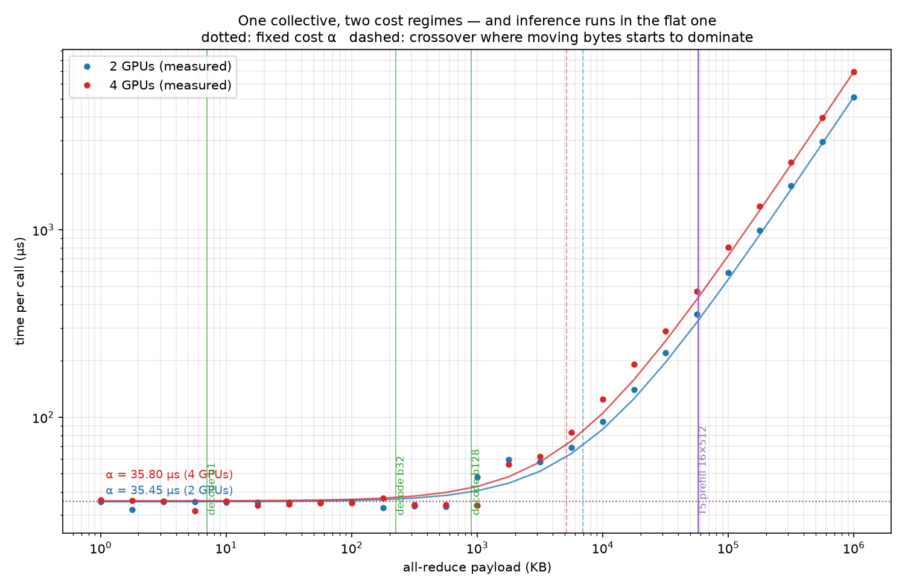

# T9 — Interconnects: what a collective costs when the message is small

**Status: harness complete, bands registered, not yet measured.** Everything below the line is
committed *before* the GPU node exists. The numbers in the Results section are blank on purpose —
they get filled in from one session on a 4× A100 NVLink box, pass or fail.

**Question:** T5 measured tensor parallelism end to end and found that its communication *volume*
does not explain its cost — 940 MB per step is only ~4% of the step at NVLink bandwidth, yet TP
scaled worst of the three dense strategies. T5's conclusion was that the loss is "frequency and
shape" rather than volume. **So what does one all-reduce actually cost, and how much of that cost
is there before it moves a single byte?**

---

## Why this is not T5 again

A collective is not priced in bytes. It is priced as

    t(n) = α + n / β

`α` is what the call costs before any useful byte moves: kernel launch, ring setup, and `2(N-1)`
dependent hops each of which must complete before the next begins. `β` is the rate once it is
moving. Every all-reduce pays both, and which one dominates is decided entirely by `n`.

T5 and decode sit on **opposite ends of that curve**, and this is the whole reason the topic
exists:

| | payload per all-reduce | regime |
|---|---|---|
| T5's TP, batch 16 × seq 512 | **58,720,256 B** | far out on `n/β` — bandwidth-bound |
| Decode, batch 1 | **7,168 B** | entirely inside `α` — latency-bound |
| Decode, batch 128 | 917,504 B | crossing over |

**8,192×** apart. T5 measured the fast end. Inference runs at the slow one, and the fabric's
headline bandwidth number describes a regime decode never enters. A test in
`tests/test_distinctness.py` asserts that separation rather than leaving it as a claim in prose.

## Why α should grow with world size

NCCL's bandwidth-optimal algorithm is a ring: reduce-scatter over `N-1` steps, then all-gather over
another `N-1`. Each step ships `n/N` bytes to one neighbour:

    hops       = 2(N-1)              dependent, so 2(N-1) latencies in series
    wire bytes = 2(N-1)/N · n        the "bus" volume NCCL reports

    t(n, N) = 2(N-1)·α_step  +  2(N-1)/N · n/β_link

Two things fall straight out, and both are pre-registered below:

1. **The fixed cost scales as `2(N-1)`, not `N`.** Going 2 → 4 GPUs should multiply α by **3.0**.
   If decode is α-bound, sharding wider costs *more per call* while each call still carries the
   same bytes — the cost goes up and the payload does not.
2. **The moving cost saturates.** `2(N-1)/N` runs 1.0 → 1.5 → 1.75 → 2.0, so wire traffic
   approaches twice the payload however wide the ring gets.

---

## Pre-registered bands

Committed in `results/predictions.json` before the node was rented. Reported WITHIN/OUTSIDE either
way — T8 failed two of three and was a better note for it.

| # | band | predicted | measured | verdict |
|---|---|---|---|---|
| 1 | α(4)/α(2), from `2(N-1)` | **3.0** ± 30% | — | — |
| 2 | asymptotic bus bandwidth vs the node's NVLink spec | **≥ 70%** | — | — |
| 3 | batch-1 all-reduce is fixed cost | **≥ 90%** | — | — |
| 4 | fitted model predicts a real TP layer's comms | within **1.5×** | — | — |

Bands 1–3 are *structural* — they follow from the ring algorithm alone, so they could be committed
to without knowing anything about the hardware, which is what makes them worth pre-registering.
Band 4 is the one that can genuinely fail for an interesting reason: a two-term model fitted to an
isolated microbenchmark is only worth anything if it survives contact with a collective embedded in
real work.

### The prediction it implies

From T6's measured error budget, read out of `t06/results/perf.csv` at runtime rather than retyped
(weight share **73.7%**, step **11.05 ms**, **90.5 tok/s**), and an **assumed** α of 8 µs — the one
term not yet measured, and flagged as assumed everywhere it appears:

| | comms/token | predicted TP speedup |
|---|---|---|
| TP2 | 448.8 µs | **1.49×** |
| TP4 | 1,345.3 µs | **1.76×** |

Not 2× and 4×. Two GPUs double the memory bandwidth that T6 showed decode is bound by, but the
collectives are 56 fixed-cost calls per token, and at TP4 that fixed cost triples while the payload
stays 7 KB. **The prediction is that sharding buys least exactly where latency matters most** — and
the measurement is what decides whether that is right.

The speedup model is Amdahl with a comms penalty, the same law T5 calibrated and T8 reused:

    speedup = 1 / ( (1-w) + w/N + comms_per_token/step )

It is deliberately **optimistic** and should be read as an upper bound. It holds the non-weight 26%
fixed under sharding, which T5 measured to be false: each rank runs a matmul 1/N the size and gets
proportionally less from the GPU, and every all-reduce is a barrier that costs the slowest rank's
jitter. Both push the real number down. An optimistic prediction that still lands near the
measurement is a stronger result than a hedged one that cannot be wrong.

---

## Results

*Blank until the session runs.*



---

## Method, and the one thing that would invalidate all of it

**The topology gate.** A rented multi-GPU node is not guaranteed to have NVLink between the GPUs
you were given. The symptom is not an error — it is a plausible bandwidth number roughly 10× too
low, which would land in this note as a fact about NVLink. That is the single failure mode that
would invalidate the topic, so the gate runs first and **aborts** rather than warns:

1. **Declared** — parse `nvidia-smi topo -m`, require `NV#` between every pair in the world.
   Catches GPUs on separate PCIe root complexes (`SYS`, `NODE`, `PHB`).
2. **Empirical** — actually move 256 MB and require ≥ 100 GB/s of bus bandwidth. Catches what the
   matrix cannot: virtualised or mislabelled topology, a link that negotiated down, and NCCL
   declining to use NVLink for its own reasons.

The matrix is a claim; the second one is a measurement, and only one of those is evidence. Both
are recorded to `results/topology.txt`, because the fabric is part of the result — a reader who
cannot see which wire produced a bandwidth number has to take it on trust.

**Fitting α and β separately, from the two regions that constrain them.** The first version of the
estimator ran one least-squares fit across the whole sweep. Feeding it a synthetic curve built with
a known α = 7.5 µs recovered **13.2 µs** — a 76% error in the one number this topic exists to
report. Across six decades of message size, OLS on raw bytes gives the top decade almost all the
leverage. So:

- **α** is the median of the flat floor (≤ 16 KB), where the moving term is ~0.05 µs and the
  region's height *is* α. Median rather than mean because one scheduler hiccup is a large outlier
  at microsecond scale.
- **β** is the slope over the ramp (≥ 4 MB) only. That fit's intercept is discarded —
  extrapolating a line fitted at hundreds of megabytes back to zero measures nothing.
- **R²** is the ramp's, so it answers the question actually being asked: is the large-message
  region a straight line, or did NCCL switch between tree and ring partway up? That switch is real,
  and averaging across it would produce a confident bandwidth describing neither regime.

`test_t09.py` builds curves from known parameters and checks the estimator recovers them, the same
move T5 made with Amdahl. An estimator not tested against a known answer is a number generator.

**Steady state, and the slowest rank.** Each timing window holds 16 back-to-back collectives, for
the same reason T8 batches its launches: a small all-reduce takes single-digit microseconds, so
timing one alone reports the dispatch path. It is also faithful — a TP decode step fires 56 of
these in sequence. Every measurement is reduced across ranks with `MAX`, because a collective is a
barrier and its cost is the cost to its slowest participant; timing rank 0 alone would report
whichever rank was luckiest.

**Stage 3 measures the collective in situ.** `measure.py` times an all-reduce with nothing else on
the GPU and the same buffer every time — the cleanest possible setting, and therefore the most
flattering. `tp_matmul.py` runs a real row-parallel down-projection (Qwen2.5-7B's K=18944,
N=3584 — T7 and T8's shape) and takes the collective's cost as *step with it minus step without
it*. World size 1 is the control: identical code path, no collective.

## Caveats, stated in advance

- **4-way measured, and nothing beyond it is claimed.** 8-way brings NVSwitch behaviour this
  configuration cannot observe. The `2(N-1)` model predicts further out; this topic will not have
  tested it there.
- **The TP speedup figures are modelled, not a re-run of vLLM.** They compose T6's error budget
  with a measured α. Labelled as modelled wherever they appear. Stage 3 measures a single layer's
  collective, not an end-to-end serving stack.
- **Synthetic tensors.** The collective's cost depends on the shape and the fabric, not the values,
  exactly as in T7 and T8.
- **One fabric.** NVLink on one node. The interesting contrast is PCIe, where α is several times
  larger — the model predicts what that does to the decode case, but this topic will not have
  measured it.
- **gloo/CPU numbers are rehearsal and are never published.** Loopback has a different α and no
  ring at all.

## Reproduce

```bash
uv sync
make t9-predict     # register the bands — laptop, no GPU
make t9-rehearse    # identical harness over gloo on CPU; numbers not published
uv run pytest topics/t09_interconnects tests    # 32 unit tests + distinctness, no GPU

# on a 4x A100 NVLink node, on-demand:
make probe          # once per pod
make t9             # topology gate -> sweep -> fit -> plots
make t9-tp          # stage 3, band (4)
```
