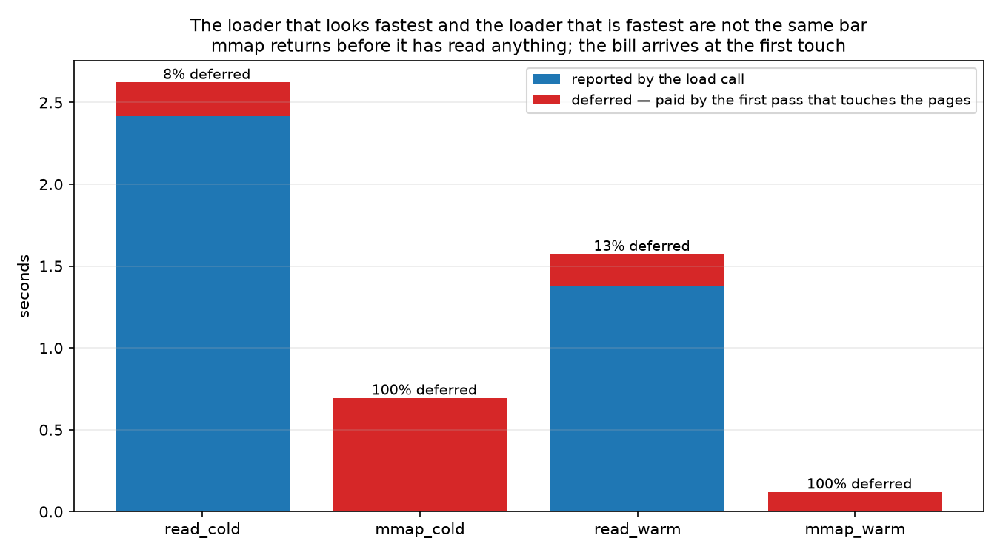
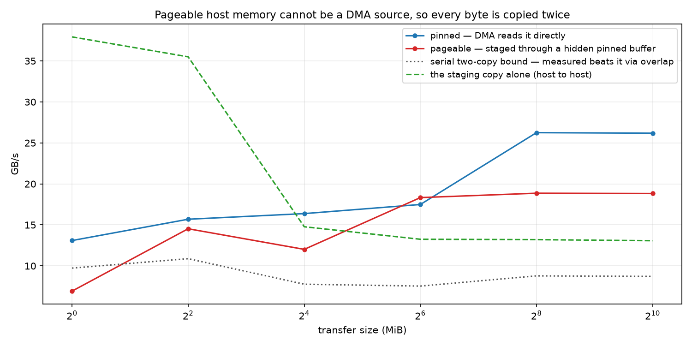

# T10 — OS & virtual memory: what a cold start actually costs

**Question:** T1–T9 all begin with the weights already in HBM. **How did they get there, and what
does that cost the first time?**

Framed as cold start, because that is where the question has consequences: a pod that scales to
zero, a spot instance that gets preempted, a multi-model server swapping checkpoints, an autoscaler
adding a replica under load. All four pay this path, and none of them pay it again.

**Setup:** 1× NVIDIA A100-SXM4-80GB, driver 580.159.04, torch 2.8.0+cu128, PCIe Gen4. Measured
memory bandwidth **1,737.1 GB/s** — T6, T7 and T8 ran at 1,736.7 and T9 at 1,736.9, so this is the
same silicon to within **0.02%** and the numbers below compose with theirs. Session `7e6c8b9fba8e`,
shared with T11. Payload is an 8 GiB synthetic weight file on the container's NVMe; model-scale
figures are extrapolated from the measured per-stage rates and labelled where they appear.

---

## Result



**The loader that looks 22,000× faster is genuinely faster — but for the opposite reason to the one
the benchmark implies, and on this hardware the storage was never the bottleneck.**

| loader | cache | load call | first touch | total | deferred | faults/page | "load" GB/s |
|---|---|---|---|---|---|---|---|
| mmap | cold | 0.0001 s | 0.694 s | **0.694 s** | 100.0% | 0.002 | **66,903** |
| mmap | warm | 0.0001 s | 0.120 s | **0.120 s** | 99.9% | 0.002 | 139,797 |
| read | cold | 2.415 s | 0.208 s | **2.623 s** | 7.9% | 0.144 | 3.56 |
| read | warm | 1.374 s | 0.199 s | **1.573 s** | 12.6% | 0.063 | 6.25 |

That 66,903 GB/s is **38× this GPU's HBM bandwidth**, for a file on a disk. The number is not
wrong; the metric is. `mmap` returned after installing a mapping, having moved nothing, and a
stopwatch around it measures a promise. This is what every loader benchmark that times only the
load call is reporting.

| # | pre-registered band | predicted | measured | verdict |
|---|---|---|---|---|
| 1 | pinned / pageable H2D | ≥ 1.8× | **1.39×** | **OUTSIDE** ✗ |
| 2 | mmap / read, load call only | ≥ 3× | **22,368×** | WITHIN ✓ |
| 3 | mmap / read cold, faults charged back | ≤ 1.2× | **3.78×** | **OUTSIDE** ✗ |
| 4 | cold / warm read | ≥ 3× | **1.76×** | **OUTSIDE** ✗ |
| 5 | read path vs host memcpy | ≥ 60% | **47.3%** | **OUTSIDE** ✗ |
| 5 | pinned H2D vs its own asymptote | ≥ 60% | **100.0%** | WITHIN ✓ |

**Four of six failed**, and three of them failed for the same underlying reason: **this box's
storage is fast enough that copying, not reading, is the bottleneck.** That inverts the assumption
every band was built on.

---

## Band 3: mmap wins even cold, and the deferral is not why

The registered claim was that `mmap`'s enormous apparent advantage would collapse once its deferred
page faults were charged to the first pass that touches them, because the pages it did not read
still have to arrive. Charged back, cold, it is still **3.78× faster**.

The deferral half of the claim is exactly right — `mmap` deferred **100.0%** of its true cost, and
the first-touch column is where all of it landed. What is wrong is the assumption that the deferred
work is the *same* work. It isn't:

    read:  disk -> page cache -> [copy] -> process buffer
    mmap:  disk -> page cache -> [map]  -> process address space

`read` moves every byte twice. `mmap` moves them once and maps the result. On slow storage that
second copy is lost in the noise and the two converge, which is what the band assumed. On this box
the copy is the slower half.

The numbers say so directly. `mmap` cold moved 8 GiB in 0.694 s = **12.4 GB/s**, which is the
storage. Warm `read` ran at **6.25 GB/s**, and warm means no disk at all — so that is the copy, on
its own. Composed in series, `1/(1/12.4 + 1/6.25)` = **4.15 GB/s** against a measured cold `read`
of **3.56**. The two-stage account of the copying loader holds to 15%.

**So the correct statement is not "mmap defers, and deferral is free". It is "mmap is zero-copy,
and on fast storage the copy is the expensive part."** The deferral is real and it is charged
honestly here; it is simply not what makes `mmap` win.

## Band 4: the storage was the assumption that broke

`cold / warm read` came out at **1.76×** against a registered ≥ 3×. The band assumed a cloud NVMe
runs at a few GB/s while a page-cache hit runs at tens, which is the usual shape. Here the storage
delivers 12.4 GB/s and the page-cache path delivers 6.25 GB/s **through a single-threaded copy** —
so warm is only 1.76× ahead, and the ratio is small because the *warm* side is slow, not because
the cold side is fast.

This is the band whose failure most changes the advice. On storage this quick, "warm the page
cache" is a much weaker lever than "stop copying".

## Band 1: two copies, but not two costs



Pageable host memory cannot be a DMA source — the OS may relocate it mid-transfer — so CUDA stages
it through a hidden pinned buffer first. Every byte is copied twice, which is why the band
predicted ≥ 1.8×. Measured: **1.39×**.

The mechanism check explains the gap, and it needed the staging copy measured on its own:

| at 256 MiB | GB/s |
|---|---|
| pinned H2D | **26.25** |
| pageable H2D | **18.86** |
| host memcpy (single-threaded) | 13.20 |
| **serial two-copy bound** | **8.78** |

If the staging copy and the DMA took turns, pageable would run at 8.78 GB/s. It runs at 18.86 —
**2.15× above the serial bound**. The runtime chunks the transfer and overlaps each staging copy
with the previous chunk's DMA, so the second copy is largely hidden behind the first. Two copies,
one cost.

Pinned still wins, and for a 15 GB model 1.39× is 0.2 s of the budget. But the "pageable is half
speed" folk rule over-predicts the penalty by 55% on this hardware.

## The cold start, in tokens

Extrapolating the measured per-stage rates to Qwen2.5-7B's 15.23 GB — **the stage rates are
measured, the payload is not**:

| stage | rate | time | share |
|---|---|---|---|
| storage read (cold, copying loader) | 3.56 GB/s | 4.28 s | **71%** |
| host memcpy | 13.20 GB/s | 1.15 s | 19% |
| H2D pinned | 26.25 GB/s | 0.58 s | 10% |
| **total** | | **6.02 s** | |

Against T6's measured 11.05 ms decode step, that is **545 tokens not generated**. The
pre-registration guessed 6.45 s and 584 tokens from assumed rates — 6.7% out, but by luck rather
than judgement: it assumed storage at 3.0 GB/s (measured 3.56), memcpy at 20 (measured 13.2) and
H2D at 25 (measured 26.2). Two errors in opposite directions.

**The actionable version:** stage 1 dominates, and stage 1's rate is a property of the *loader*, not
of the disk. The same storage delivers 12.4 GB/s to a memory-mapped read and 3.56 GB/s to a copying
one. Choosing the loader is worth more here than any amount of cache warming.

And in serving terms: 545 tokens is the price of a cold start. If your traffic gap is worth less
than that, scale-to-zero costs more than it saves.

## Why this is not any other topic

| | payload | link | when |
|---|---|---|---|
| **T10** | **15.2 GB, once** | **PCIe, ~26 GB/s** | before the first token |
| T11 | 7 KB, every step | inside HBM, 1,737 GB/s | forever |
| T6–T9 | — | — | assume the weights are already resident |

PCIe is **66× narrower** than the HBM every other topic measures, and the whole model crosses it
exactly once. `tests/test_t10_t11_distinctness.py` enforces the split by metric vocabulary and by a
payload ratio of two million.

## Method notes

**Going cold does not need root, and this pod proved why that matters.** The textbook mechanism is
writing `/proc/sys/vm/drop_caches`, which needs root *and* a container privileged enough to mount
`/proc/sys` writable. This pod: **not writable**, as rented containers generally are not.
`posix_fadvise(POSIX_FADV_DONTNEED)` drops one file's cached pages, needs no privileges, and is the
better instrument anyway — it evicts the weight file rather than the whole system's cache, so the
measurement is not perturbed by having just discarded the pages backing Python and torch.
`go_cold()` prefers it, falls back to the global drop, and **refuses if neither works**.

**The eviction is verified, and the first verification was wrong.** It originally looked for major
faults and found **one** for 8 GiB that had genuinely just been evicted. Two reasons, both real:
`read()` takes no page faults at all (the kernel copies out of the page cache, so there is no
mapping to fault on), and for `mmap` sequential readahead fetches pages before they are touched,
turning would-be major faults into minor ones. The working check is the same loader against itself —
cold must be markedly slower than warm. It was **5.8×**, so the eviction worked; the instrument was
wrong, not the result.

**The host memcpy measurement was broken on the first run, and obviously so once seen.** Reported
bandwidth scaled *linearly with buffer size* across three decades — 0.01 GB/s at 1 MiB rising to
10.02 at 1 GiB — which is what a constant time per call looks like when you divide bytes by it.
Every size took ~100 ms.

The cause: this container reports **255 CPUs** through `sched_getaffinity` while its cgroup limits
it to 16, so torch defaulted to 255 intra-op threads and every `copy_` paid ~80–100 ms of pure
thread-pool scheduling. Single-threaded, the same 256 MiB copy runs at **13.2 GB/s** against the
**3.3** it was reporting. `memcpy_gbps` now pins the thread count to 1, which is also the faithful
measurement: the copy it stands in for is the serial `memcpy` the driver performs internally, not a
parallel one.

**The weight file is incompressible.** A file of zeros can be stored as a hole and then "read" at
memory speed, which would make stage 1 look like DRAM. A test asserts its entropy.

**First touch is one byte per page, not a full traversal**, so it isolates fault handling from
memory traffic — and it is the fault handling that `mmap` deferred.

**Fault counts are low because kernels fault around.** `mmap` shows 0.002 faults per 4 KB page: with
transparent huge pages the granule is 2 MB, so one fault covers 512 pages. "One fault per page" is
the model, not the measurement.

## Caveats

- **The payload is synthetic and 8 GiB; the model-scale numbers are extrapolated.** Per-byte rates
  are what generalise, but a real checkpoint is many files with metadata between them, and
  `safetensors` mmaps rather than copying — which this note suggests is the right choice.
- **One storage device, and a fast one.** Three of the four failed bands trace to that. On a slower
  disk band 3 and band 4 would likely pass, which is a statement about the hardware and not about
  the mechanism. The mechanism — mmap is zero-copy, the copy costs 6.25 GB/s — is what transfers.
- **Stage 1's rate depends on the loader**, so the cold-start table's 71% is the copying loader's
  share. With a mapped loader stage 1 would be ~1.2 s, not 4.28.
- **Pinning cost is excluded.** `cudaHostAlloc` on a multi-gigabyte buffer is not free; this
  measures the transfer, not the setup, which is what a serving stack that allocates one staging
  buffer at start-up actually experiences.
- **Huge pages were not varied.** `page_count` shows the 512× arithmetic and THP is evidently
  active, but no controlled comparison was run.

## Reproduce

Off the clock, on any machine:

```bash
uv sync
make t10-predict     # file the bands — laptop, no GPU, no root
make t10-rehearse    # the same harness, warm only, small file; numbers not published
uv run pytest topics/t10_os_virtual_memory tests
```

On a single-GPU Linux pod — see [`scripts/t10_t11_session.sh`](../../scripts/t10_t11_session.sh),
which shares one pod and one hardware probe with T11:

```bash
bash s.sh gate      # 1 GPU, a way to evict the page cache, enough disk. ~10s.
bash s.sh setup     # clone + uv sync + make probe
bash s.sh t10       # cold/warm x read/mmap, then H2D, then the bands
```

**Put the weight file on the container's NVMe, not `/workspace`.** RunPod mounts `/workspace` as
network storage. For most topics that is merely slow; for this one it is fatal, because stage 1
would be measuring a network filesystem and the note would describe it rather than a disk.

Every number quoted here is asserted against `results/coldstart.csv` by the `test_lab_note_*` tests
in `test_t10.py`, so the prose cannot drift from the data.
