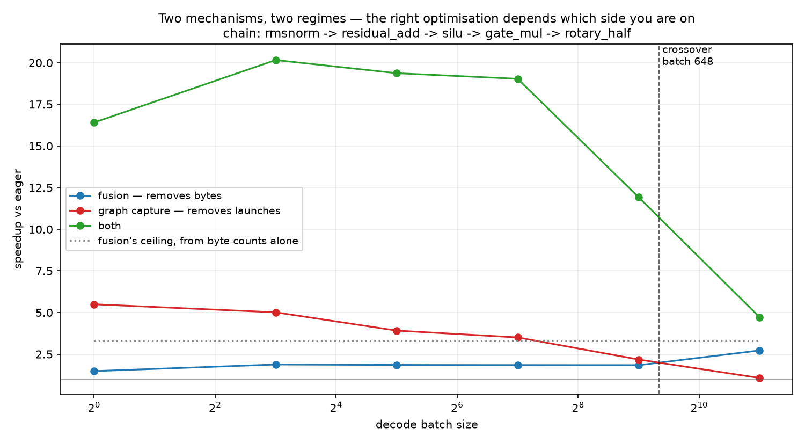

# T11 — Compiler & runtime: fusion and graph capture are two wins, not one

**Question:** Compilation is sold as one number. It is two mechanisms with different costs and
**opposite payoffs**. Where does the dominant one flip?

    fusion          merges ops into one kernel, so intermediates stay in registers
                    instead of round-tripping through HBM            -> removes BYTES
    graph capture   records the launch sequence once and replays it
                    with a single call                               -> removes LAUNCHES

**Setup:** 1× NVIDIA A100-SXM4-80GB, driver 580.159.04, torch 2.8.0+cu128. Measured memory
bandwidth **1,737.1 GB/s** — the roof every figure below is scored against, and within **0.02%** of
T6/T7/T8's 1,736.7. Session `7e6c8b9fba8e`, shared with T10. Chain shape is Qwen2.5-7B's hidden
size (3584), bf16, as in T5–T9.

---

## Result



**Both mechanisms work, neither substitutes for the other, and which one dominates flips at batch
648.**

| batch | eager | compile | graph | compile+graph | fusion | graphs | both |
|---|---|---|---|---|---|---|---|
| 1 | 141.5 µs | 95.4 | 25.8 | **8.6** | 1.48× | **5.50×** | **16.4×** |
| 8 | — | — | — | — | 1.88× | 5.01× | 20.2× |
| 32 | — | — | — | — | 1.85× | 3.91× | 19.4× |
| 128 | — | — | — | — | 1.85× | 3.50× | 19.0× |
| 512 | — | — | — | — | 1.84× | 2.18× | 11.9× |
| 2048 | 249.7 µs | 91.7 | 233.7 | **53.0** | **2.72×** | 1.07× | 4.7× |

At batch 1 graph capture is worth **5.50×** and fusion **1.48×**. At batch 2048 they have swapped:
fusion **2.72×**, capture **1.07×** — capture has become worth almost nothing. Applying both is
worth **up to 20×**, which is more than either alone at every batch size measured.

| # | pre-registered band | predicted | measured | verdict |
|---|---|---|---|---|
| 1 | fusion speedup at batch 1 | ≤ 1.1× | **1.48×** | **OUTSIDE** ✗ |
| 2 | graph speedup at batch 1 | ≥ 2× | **5.50×** | WITHIN ✓ |
| 3 | crossover batch | in [64, 512] | **648** | **OUTSIDE** ✗ |
| 4 | fused chain vs memory roof | ≥ 70% | **27.6%** | **OUTSIDE** ✗ |
| 5 | measured fusion vs byte model | within 1.5× | **0.82×** | WITHIN ✓ |

**Three of five failed.** Two of the three failures have clean mechanical explanations that the run
itself produced, and the third — band 3's chain-length control — genuinely refuted part of the
model. All three are more useful than the passes.

---

## The crossover is real, and the model's *input* was what was wrong

Band 3 registered a crossover in [64, 512], from a model fed an **assumed** 5 µs launch cost —
because nothing in this repo had ever measured one for a plain kernel. T9 measured a *collective's*
fixed cost at ~34 µs and explicitly left this untested.

This run can measure it. The gap between eager and graph replay is exactly the launch cost capture
removed:

    L = (eager − graph) / ops = (141.5 − 25.8) / 5 = 23.15 µs per chain op

Feeding that into the **same unchanged formula** predicts batch **801** against a measured **648** —
**24% out**, against the 3.7× the assumed input was out by. The model's structure survives; the
number it was given did not.

(Per *kernel* rather than per chain op it is 10.5 µs, because eager runs 11 kernels for a 5-op
chain — see below, that discrepancy matters.)

## How much of batch 648 is the framework rather than the machine

Enough that the honest headline is a range, and this is the sharpest limitation on the number above.

The registered crossover compares `eager/compile` against `eager/graph`. The `compile` column pays
Dynamo's guard and dispatch cost on every call and the `graph` column does not — and that cost is
nearly constant across the whole sweep (`compile` runs 95.4 µs at batch 1 and 91.7 µs at batch 2048,
for 2,048× the work). It is a **host** cost, on a container that reported 255 CPUs while cgroup-
limited to 16. It penalises fusion at every batch and therefore pushes the crossover later.

Comparing the two graph-captured columns instead — `graph` (unfused) against `compile_graph`
(fused) — measures the same fusion with that cost removed from both sides:

| batch | fusion, as registered | fusion, host cost removed | capture |
|---|---|---|---|
| 1 | 1.48× | **2.99×** | 5.50× |
| 8 | 1.88× | **4.02×** | 5.01× |
| 32 | 1.85× | **4.95×** | 3.91× |
| 128 | 1.85× | **5.43×** | 3.50× |
| 512 | 1.84× | **5.48×** | 2.18× |
| 2048 | 2.72× | **4.41×** | 1.07× |

Run the repo's own log2 interpolation over the last two columns and the crossover falls from **648
to 15.8** — a factor of **41**.

**The registered band stands as it was scored**; this is reported beside it, not in place of it, and
nothing is rescored. But it changes what the headline means. The device-side mechanisms swap over
very early — by batch ~16 fusion is already the larger win. What sits at 648 is the batch at which
fusion overtakes capture *once fusion is also paying ~90 µs per call to the Python-side compiler
stack*. Both are real numbers a practitioner meets; they answer different questions.

The one to quote depends on which you are asking. **"Which mechanism should I reach for at batch
32?"** — capture, if you are calling `torch.compile` in the hot path on a CPU like this one; fusion,
if the guard cost is amortised or the host is faster. That the two answers differ by 41× in
crossover is the finding, and it is a much better warning than a single batch number would have been.

## The control refuted the chain-length prediction, and that is the most useful result here

The model says fusion removes `2k−3` round trips while capture removes `k` launches, so a shorter
chain should cross over **later** by exactly `(2·5−3)/(2·2−3)` = **7×**. `make t11-control` re-runs
the whole sweep at 2 and 3 ops to test that.

| chain | crossover | model predicted | measured shift |
|---|---|---|---|
| 5 ops | 648 | — | — |
| 3 ops | **631** | 2.33× later | **0.97×** |
| 2 ops | **748** | 7.00× later | **1.16×** |

**The crossover barely moves.** The prediction is refuted — not marginally, but by a factor of six.

The data says why, and both halves of the model were wrong in offsetting directions:

|  | model said | measured (2 → 3 → 5 ops) |
|---|---|---|
| `compile` time | constant in `ops` (one launch + boundary traffic) | **62.3 → 63.3 → 91.7 µs** — grows |
| `graph` time @2048 | linear in `ops` (`2k·A/BW`) | **135.3 → 156.2 → 233.7 µs** — sublinear |

`compile` is not constant because Dynamo's guard and dispatch cost grows with the traced graph.
`graph` is sublinear because each kernel carries a fixed device-side cost on top of its traffic. The
crossover is where those two curves meet, and since both rise with `ops`, the intersection barely
moves. **Two modelling errors that happen to cancel.**

Worth being precise about what this does and does not vindicate. An earlier draft of the derivation
cancelled `ops` and predicted no chain-length dependence — which is what the data shows. That draft
was not right; it reached the correct conclusion by asserting `compile = 1·L + 3A/BW`, which the
measurements above show is false. **Getting the answer from wrong premises is not a validated
model**, and the note is not going to claim it was.

What survives is empirical and still useful: **the crossover sits at 630–750 and is insensitive to
chain length over 2–5 ops.**

### The second control: it was never chain length, it was fusion completeness

The control above cannot actually separate two explanations, and the first write-up said so as a
caveat rather than resolving it. The 2- and 3-op chains fuse to **one** kernel; the 5-op chain fuses
to **two**, because the rotary `cat` materialises. So "longer chain" and "less completely fused"
moved together, and a flat crossover is consistent with either.

`make t11-fusing` separates them. Same five ops, same byte model, fifth op swapped from the rotary
rotation to the next block's post-attention RMSNorm — real, weightless, and with no `cat` for
Inductor to give up on. Chain length is held at five and **only fusion completeness changes**:

| 5-op chain | kernels after `compile` | crossover | fusion @1 | fusion @2048 |
|---|---|---|---|---|
| rotary (`cat` blocks fusion) | 2 | **662** | 1.33× | 2.74× |
| all-fusing (post-norm) | **1** | **102** | **3.52×** | **4.90×** |

**The crossover collapses by 6.5× when the only thing that changes is whether the chain fuses
completely.** Against 1.16× for halving the chain length. Chain length was never the variable; the
first control was measuring fusion completeness and attributing it to length.

Two independent runs of the fusing chain put its crossover at **102 and 139**, against **662 and
636** for the rotary chain in the same two runs — so the point estimate is noisy where the two
curves run close together, but the effect is 4.6–6.5× either way and the direction is not in doubt.
The committed rotary figure of 648 sits inside that spread, which is the reproducibility check.

**This is the caveat the first write-up flagged as "the next thing I would measure", and it came back
against the model rather than for it.** The registered band stays failed and the refutation stands —
what changes is the diagnosis. The model's error was not the `2k−3` traffic term being wrong in
principle; it was that the term assumes complete fusion, and the chain it was scored on did not
deliver it.

## Band 4: the chain does not fully fuse, and the kernel counts prove it

Registered at ≥ 70% of the memory roof; measured **27.6%**. Two separate things are wrong with that
number, and the run diagnosed both.

**First, it was scored against the wrong mode.** `compile` runs the fused kernel *and* pays Dynamo's
guard evaluation on every call. That cost is roughly constant, which is why `compile` times barely
move across four decades of batch (95.4 µs at batch 1, 91.7 µs at batch 2048 — for 2,048× the work).
The same kernel graph-replayed reaches **831.7 GB/s = 47.9% of roof**, not 27.6%. **The band stays
failed as registered** — rescoring after seeing the data is the thing this repo exists not to do —
but 20 percentage points of it were framework overhead, not the fuser.

**Second, and this is the real finding: the 5-op chain does not fuse into one kernel.**

| chain | eager kernels | after `torch.compile` | fused bandwidth @2048 | vs roof |
|---|---|---|---|---|
| 2 ops | 7 | **1** | 1,592 GB/s | **91.7%** ✓ |
| 3 ops | 8 | **1** | 1,391 GB/s | **80.1%** ✓ |
| 5 ops | 11 | **2** | 832 GB/s | **47.9%** ✗ |

The fifth op is a rotary-style `chunk` then `cat`, and Inductor emits a **second kernel** for it —
the concatenation materialises rather than fusing away. One extra HBM round trip, and the achieved
bandwidth halves.

So band 4 fails on the 5-op chain and would have **passed comfortably on either shorter one**. That
is a statement about which ops fuse, not about how well Inductor fuses the ones that do: where the
chain collapses to a single kernel, it reaches **80–92% of the measured memory roof**.

## Band 1: fusion helps more than bytes alone predict

Registered at ≤ 1.1× — the reasoning being that at batch 1 the whole chain is 7,168 B, about
**41 nanoseconds** of traffic at 1,737 GB/s, so there is essentially no traffic for fusion to remove.
Measured **1.48×**.

The arithmetic was right and the model was incomplete. Fusion does not only remove HBM round trips;
it removes **kernels**, and each kernel eager-dispatched costs Python and dispatch time on the host.
Eager runs **11** kernels for this chain and `compile` runs **3 at batch 1** and 2 at every larger
batch — Inductor picks a slightly different schedule for the smallest case. At batch 1 that kernel
removal is the whole effect: the byte model predicted only the part of fusion that is about bytes.

This also explains part of why band 3's chain-length prediction failed: the model's `ops` (5) and
the real kernel count (11) are not the same number, and they do not scale together.

## What this is for

The practical shape is regime-dependent, which was the hypothesis and is what the data shows:

- **Low-batch, latency-sensitive serving** → **capture the graph**. Worth 5.5× at batch 1; fusion is
  worth 1.5×. This is where a chat endpoint at batch 1–32 lives.
- **High-batch, throughput serving** → **fuse**. Past batch ~650 capture is worth almost nothing
  (1.07× at 2048) while fusion is worth 2.7×.
- **Do both** — 16–20× across the low and middle batches, more than either alone everywhere.
- **Check that your chain actually fused** — this turned out to be the largest effect in the topic.
  A single non-fusing op costs half the achievable bandwidth *and* moves the batch at which fusion
  becomes the right lever by **6.5×**. Nothing warns you; the kernel count does. `chunk`/`cat` is
  the op that broke it here, and it is everywhere in rotary embedding implementations.

It also closes a thread T9 opened deliberately: T9 measured a *collective's* fixed per-call cost at
~34 µs and noted plain kernel launches were the same phenomenon, untested. Measured here at
**10.5 µs per kernel** on the same class of hardware.

## Why this is not T6 again

T6 measured CUDA graphs on a whole vLLM step and found 15–36%, with the loss growing with batch.
Same direction as band 2 here, and it is a *bundle*: both mechanisms at once, on a stack you do not
control, reported as one number.

| | owns | payload | units |
|---|---|---|---|
| T6 | the whole engine, bundled | a 7B model | ms/step, tok/s |
| **T11** | **one weightless subgraph, unbundled** | **7 KB per activation** | µs, kernel launches |
| T10 | the cold path, before any of this | 15.2 GB, once | seconds, page faults |

`tests/test_t10_t11_distinctness.py` asserts T11 never emits a step time or a tokens/sec, so it
cannot quietly become T6 with a smaller model.

## Method notes

**The 2×2 only works if `compile` does not secretly capture graphs.** `mode="reduce-overhead"` turns
cudagraphs on inside Inductor, which would put both mechanisms in the `compile` cell and invalidate
every attribution here while all the numbers still looked plausible.
`assert_fusion_is_not_secretly_graphs()` checks Inductor's own config flag at runtime rather than
trusting the mode argument, and a unit test calls it.

**The chain is weightless deliberately.** Put a matmul in it and the weight read dwarfs everything:
at batch 1 the MLP's projections read 271 MB while their elementwise epilogue moves 37 KB, so
fusion's saving would be 0.01% and unmeasurable.

**Kernel counts come from the profiler in a separate pass** from the timing, because the profiler's
overhead inflates wall-clock badly. They are the mechanism evidence that does not depend on a timer
being fair — and they are what caught the 5-op chain emitting two kernels.

**16 back-to-back calls per timed window**, as in T8 and T9: a decode step runs this chain 28 times
in sequence and never pays for one in isolation.

## Caveats

- **`compile` is host-bound here, and that bounds what this says about fusion.** ~90 µs per call of
  guard and dispatch overhead sits on top of every `compile` measurement, and on a machine with a
  faster host CPU the fusion column would look better and the crossover would move. The container
  reported 255 CPUs while being limited to 16, which will not have helped.
- **The crossover is a property of this hardware pairing**, not a universal batch size. It is where
  a ~90 µs host-side cost meets a rising traffic cost; both terms are machine-specific. "How much of
  batch 648 is the framework" above quantifies it: remove the host cost and the same data crosses at
  **15.8**. Treat 648 as this pod's answer, not the mechanism's.
- **The chain-length confound is resolved, but not by holding everything else equal.** The
  all-fusing chain matches the rotary one on op count and byte model, and it fuses to one kernel —
  but it runs **15** eager kernels to the rotary chain's 11, because a second RMSNorm decomposes
  into more primitives than a `chunk` and a `cat`. So its eager baseline is slower and both its
  speedup columns are flattered. The crossover comparison is a ratio of ratios and survives that;
  the absolute speedups in the all-fusing row should not be read against the rotary row directly.
- **The all-fusing crossover is noisy.** 102 and 139 across two runs, because the interpolation
  lands where the two curves are nearly parallel. Quote the effect (4.6–6.5×), not the point.
- **Chain lengths 2, 3 and 5 only**, and one op swap at length 5.
- **One chain shape, one dtype, one hidden size.**
- **Inductor's default mode only.** `max-autotune` was not tried; it would change the fusion column
  and not the graph one.

## Reproduce

Off the clock, on any machine:

```bash
uv sync
uv run python -m topics.t11_compiler_runtime.predict --bandwidth 1736.7 --write
make t11-rehearse    # CPU, graph modes skipped, numbers not published
uv run pytest topics/t11_compiler_runtime tests
```

The rehearsal needs `setuptools` — `torch.compile` on CPU builds a C++ wrapper through Inductor,
which imports it at codegen time and which torch does not declare. It is in the dev group for that
reason: a rehearsal that cannot run means the first execution of this code is the one being paid for
by the hour.

On a single GPU — see [`scripts/t10_t11_session.sh`](../../scripts/t10_t11_session.sh), which shares
one pod and one hardware probe with T10:

```bash
bash s.sh setup     # clone + uv sync + make probe
bash s.sh t11       # the 2x2 across the batch sweep, then the crossover
bash s.sh control   # band 3's falsification run at shorter chain lengths
make t11-fusing     # the second control: same 5 ops, fifth one actually fuses
```

Every number quoted here is asserted against `results/compiler.csv` by the `test_lab_note_*` tests
in `test_t11.py`, so the prose cannot drift from the data.
